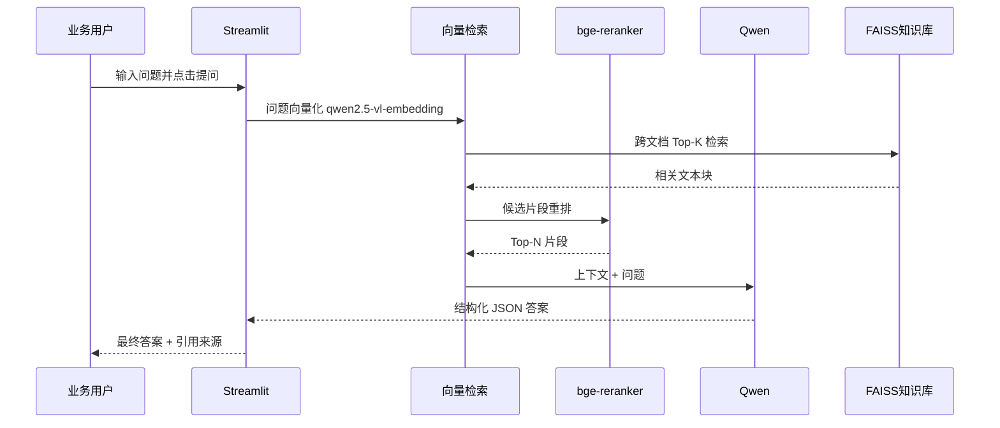
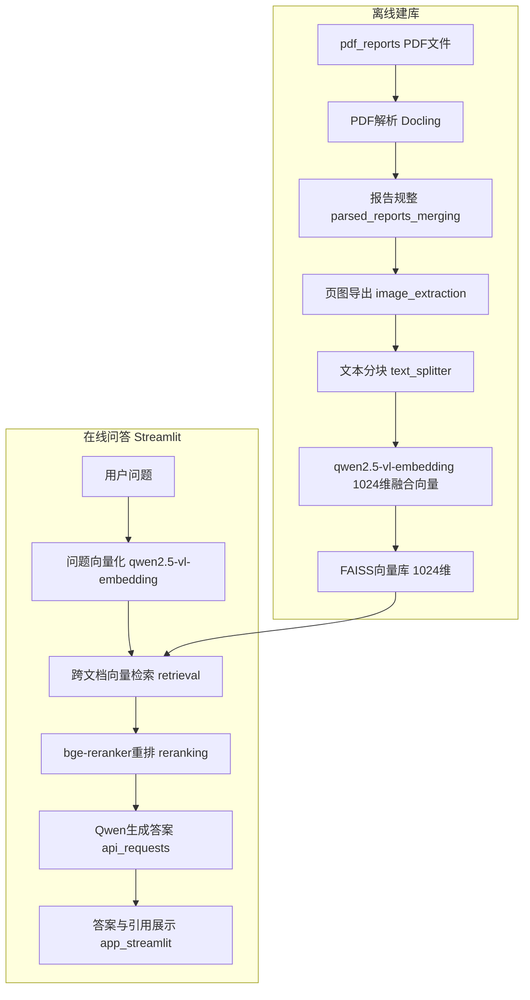
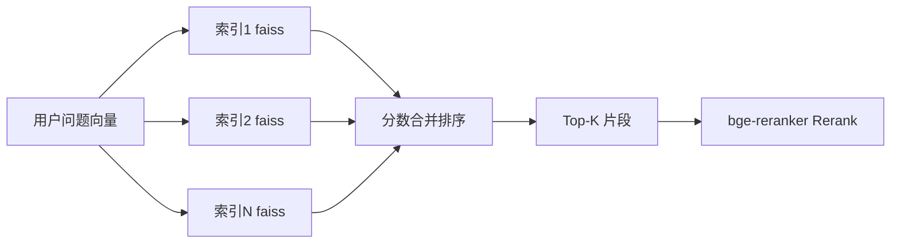

# 企业知识库 RAG 系统规格说明（SPEC）

| 项目 | 说明 |
|------|------|
| 文档版本 | v1.2 |
| 创建日期 | 2026-07-03 |
| 最后更新 | 2026-07-03 |
| 适用范围 | `01_企业知识库/rag_project` |
| 参考实现 | `01_企业知识库/参考/RAG-cy` |

---

## 1. 项目概述

### 1.1 背景

企业已积累一批城市规划、控规调整、村庄规划等 PDF 文档，目前共 **10 份**，存放于：

```
rag_project/data/项目知识库/
```

业务人员需要以自然语言快速检索这些文档中的政策要点、空间结构、用地性质等信息；文档中含大量规划图、总平面图、用地色块图等**图片内容**，需通过多模态向量化一并纳入检索。

### 1.2 目标

构建一套 **检索增强生成（RAG）** 系统：

1. 离线将 PDF 解析、分块并建立向量索引；
2. 在线通过 **Streamlit Web 界面** 接收用户问题；
3. 从 **全部文档** 中跨文档检索相关片段；
4. 调用 **阿里云 DashScope / 通义千问** 生成中文回答；
5. 附带 **文档名 + 页码 + 引用片段**，便于核验。

### 1.3 参考项目

本系统以 [RAG-cy](../../参考/RAG-cy/) 为技术参考。RAG-cy 源自 RAG Challenge 竞赛冠军方案，已完成：

- Docling PDF 结构化解析
- FAISS 向量检索（1024 维）+ bge-reranker 重排
- DashScope **qwen2.5-vl-embedding**（多模态融合向量）/ Qwen 问答
- Streamlit 单问单答界面

本系统将 RAG-cy 的 **年报/公司名路由** 模型改造为 **企业规划文档 / 跨文档检索** 模型。

### 1.4 范围与非目标

**v1 范围内：**

- 10 份现有 PDF 的全量建库与问答
- Streamlit 交互界面
- DashScope 单一 LLM 提供方
- CLI 离线建库与可选批量评测

**v1 不做：**

- 用户权限 / 多租户
- 在线 PDF 上传与管理后台
- MinerU 云端解析（RAG-cy 中的硬编码路径）
- IBM Watson / Gemini 等多模型切换
- BM25 混合检索（列为 v2 可选）
- 生产级部署（Docker / K8s / API 网关）

---

## 2. 用户场景与功能需求

### 2.1 角色

| 角色 | 说明 |
|------|------|
| 业务用户 | 通过 Streamlit 提问，查看答案与引用 |
| 管理员 | 通过 CLI 执行建库、重建索引、批量评测 |

### 2.2 功能需求

| 编号 | 场景 | 需求描述 | 优先级 |
|------|------|----------|--------|
| F1 | 自由问答 | 用户在 Streamlit 输入自然语言问题，系统返回答案及引用来源 | P0 |
| F2 | 跨文档检索 | 用户不选择文档，系统自动从全部 PDF 向量库中检索 Top-K 片段 | P0 |
| F3 | 引用溯源 | 展示答案依据的 **文档标题 + 页码** 及原文片段摘要 | P0 |
| F4 | 离线建库 | 管理员通过 CLI 触发：PDF 解析 → 分块 → 向量索引构建 | P0 |
| F5 | 增量扩展 | 新增 PDF 放入目录后重建索引（v1 采用全量重建） | P1 |
| F6 | 批量评测 | 读取 `questions.json` 批量跑题并输出 `answers.json` | P2 |

### 2.3 典型问题示例

| 类型 | 示例问题 |
|------|----------|
| 事实问答 | 「D06 单元控规调整涉及哪些用地性质变更？」 |
| 概括总结 | 「东部新城核心区的空间结构是什么？」 |
| 专题检索 | 「武城村实用性村庄规划的重点是什么？」 |
| 跨文档对比 | 「东部新城区域与核心区在空间发展定位上有何异同？」 |
| 边界情况 | 「2025 年昆山 GDP 是多少？」（应返回「未找到」） |

### 2.4 用户交互流程



---

## 3. 数据规格

### 3.1 目录布局

```
rag_project/
├── spec/
│   └── SPEC.md                 # 本文档
├── requirements.txt            # Python 依赖
├── setup.py                    # 包安装（可选）
├── main.py                     # CLI 入口
├── app_streamlit.py            # Streamlit 问答界面
├── .env                        # DASHSCOPE_API_KEY（不入库）
├── env.example                 # 环境变量样例（无真实密钥）
├── src/                        # 核心模块（从 RAG-cy 复用/改造）
│   ├── pipeline.py
│   ├── pdf_parsing.py
│   ├── parsed_reports_merging.py
│   ├── text_splitter.py
│   ├── image_extraction.py   # 从 Docling 结果导出页图/块图
│   ├── ingestion.py
│   ├── retrieval.py
│   ├── reranking.py
│   ├── questions_processing.py
│   ├── api_requests.py
│   └── prompts.py
└── data/项目知识库/
    ├── subset.csv              # 文档注册表
    ├── pdf_reports/            # 原始 PDF（与上层目录同步或迁移至此）
    ├── debug_data/
    │   ├── 01_parsed_reports/  # Docling 解析 JSON
    │   ├── 02_merged_reports/  # 规整后按页 JSON
    │   ├── 03_reports_markdown/ # Markdown 导出（人工复核用）
    │   └── 04_page_images/     # 按页/块导出的 PNG（多模态 embedding 用）
    ├── databases/
    │   ├── chunked_reports/    # 分块 JSON
    │   └── vector_dbs/         # FAISS 索引（*.faiss）
    ├── questions.json          # 评测问题集（可选）
    └── answers.json            # 批量评测输出（可选）
```

**说明：** 当前 PDF 位于 `data/项目知识库/` 根目录。实施 Phase 1 时应统一迁移或复制到 `pdf_reports/` 子目录，与 RAG-cy 的 `data/stock_data/pdf_reports/` 结构对齐。

### 3.2 文档注册表 `subset.csv`

替代 RAG-cy 中以 `company_name` 为核心的 metadata 模型。

#### 3.2.1 字段定义

| 字段 | 类型 | 必填 | 说明 |
|------|------|------|------|
| `doc_id` | string | 是 | 文档唯一标识，由项目编号规范化生成（见 3.2.3） |
| `sha1` | string | 是 | PDF 文件 SHA1 哈希，用作 FAISS 索引文件名 `{sha1}.faiss` |
| `file_name` | string | 是 | PDF 文件名（含扩展名），与 `pdf_reports/` 中文件一致 |
| `doc_title` | string | 是 | 可读标题，通常为文件名去掉 `.pdf` |
| `project_code` | string | 是 | 原始项目编号（保留罗马数字等特殊字符） |
| `year` | int | 是 | 项目年份，从编号前缀解析 |
| `region` | string | 是 | 所属区域（县/市/开发区等） |
| `doc_type` | string | 是 | 文档类型分类 |

#### 3.2.2 `doc_type` 枚举

| 值 | 含义 |
|----|------|
| 镇村布局规划 | 县域/市域镇村布局 |
| 概念性城市设计 | 概念性城市设计、站台周边设计等 |
| 控规调整 | 控制性详细规划局部调整 |
| 空间发展研究 | 区域空间发展研究 |
| 空间发展研究及城市设计 | 研究 + 城市设计合体 |
| 村庄规划 | 行政村实用性村庄规划 |
| 历史建筑修缮 | 文保/历史建筑修缮工程 |

#### 3.2.3 Metadata 映射规则

建库脚本 `scripts/generate_subset.py`（待实现）按以下规则从文件名生成 metadata：

1. **`project_code`**：取文件名中第一个空格前的编号部分，如 `2018-KS-Ⅰ-031`、`2021-Ⅰ-KS-0011`。
2. **`doc_id`**：对 `project_code` 规范化——去掉空格、将罗马数字 `Ⅰ/Ⅳ` 等替换为 `-` 或删除，仅保留字母数字与连字符，如 `2018-KS-031`、`2021-KS-0011`。
3. **`year`**：取 `project_code` 前 4 位数字。
4. **`doc_title`**：文件名去掉 `.pdf` 并 trim 空格。
5. **`region`**：按关键词规则推断（可人工校正）：

   | 关键词 | region |
   |--------|--------|
   | 滨海县 | 滨海县 |
   | 昆山 / KS / 蓬朗 / 武城村等 | 昆山市 |
   | 昆山经济技术开发区 / 东部新城 | 昆山经济技术开发区 |

6. **`doc_type`**：按标题关键词匹配（优先级从上到下）：

   | 标题关键词 | doc_type |
   |------------|----------|
   | 村庄规划 | 村庄规划 |
   | 控规调整 / 控制性详细规划 | 控规调整 |
   | 概念性城市设计 / 城市设计 | 概念性城市设计（含「空间发展研究及城市设计」时用后者枚举值） |
   | 空间发展研究及城市设计 | 空间发展研究及城市设计 |
   | 空间发展研究 | 空间发展研究 |
   | 镇村布局 | 镇村布局规划 |
   | 修缮 / 文保 / 历史建筑 | 历史建筑修缮 |

7. **`sha1`**：对 `pdf_reports/{file_name}` 计算 SHA1，建库时写入；初始 spec 占位为 `{computed_at_build}`。

#### 3.2.4 初始 10 份文档映射表

| doc_id | project_code | file_name | doc_title | year | region | doc_type |
|--------|--------------|-----------|-----------|------|--------|----------|
| 2018-KS-031 | 2018-KS-Ⅰ-031 | 2018-KS-Ⅰ-031 滨海县县域镇村布局规划.pdf | 滨海县县域镇村布局规划 | 2018 | 滨海县 | 镇村布局规划 |
| 2019-KS-001 | 2019-KS-Ⅰ-001 | 2019-KS-Ⅰ-001   S1沿线站台周边区域概念性城市设计.pdf | S1沿线站台周边区域概念性城市设计 | 2019 | 昆山市 | 概念性城市设计 |
| 2019-KS-021 | 2019-KS-Ⅰ-021 | 2019-KS-Ⅰ-021  昆山市镇村布局规划修编.pdf | 昆山市镇村布局规划修编 | 2019 | 昆山市 | 镇村布局规划 |
| 2019-KS-036 | 2019-KS-Ⅳ-036 | 2019-KS-Ⅳ-036   昆山经济技术开发区中央商贸区（金鹰、大润发）.pdf | 昆山经济技术开发区中央商贸区（金鹰、大润发） | 2019 | 昆山经济技术开发区 | 概念性城市设计 |
| 2020-KS-004 | 2020-KS-Ⅰ-004 | 2020-KS-Ⅰ-004   蓬朗老街建设和文保建筑及历史建筑修缮二期工程.pdf | 蓬朗老街建设和文保建筑及历史建筑修缮二期工程 | 2020 | 昆山市 | 历史建筑修缮 |
| 2020-KS-021 | 2020-KS-Ⅰ-021 | 2020-KS-Ⅰ-021  昆山经济技术开发区东部新城区域城市空间发展研究.pdf | 昆山经济技术开发区东部新城区域城市空间发展研究 | 2020 | 昆山经济技术开发区 | 空间发展研究 |
| 2021-KS-0011 | 2021-Ⅰ-KS-0011 | 2021-Ⅰ-KS-0011   昆山市F18规划编制单元控制性详细规划局部调整.pdf | 昆山市F18规划编制单元控制性详细规划局部调整 | 2021 | 昆山市 | 控规调整 |
| 2021-KS-0017 | 2021-Ⅰ-KS-0017 | 2021-Ⅰ-KS-0017   D06单元控规调整.pdf | D06单元控规调整 | 2021 | 昆山市 | 控规调整 |
| 2021-KS-0027 | 2021-Ⅰ-KS-0027 | 2021-Ⅰ-KS-0027   昆山经济技术开发区东部新城核心区空间发展研究及城市设计.pdf | 昆山经济技术开发区东部新城核心区空间发展研究及城市设计 | 2021 | 昆山经济技术开发区 | 空间发展研究及城市设计 |
| 2021-KS-0032 | 2021-Ⅰ-KS-0032 | 2021-Ⅰ-KS-0032   武城村、凤凰村、西南村、环湖村、夏东村行政村实用性村庄规划.pdf | 武城村、凤凰村、西南村、环湖村、夏东村行政村实用性村庄规划 | 2021 | 昆山市 | 村庄规划 |

> `sha1` 列在首次运行 `generate_subset.py` 后自动填充。

#### 3.2.5 分块 JSON Schema

每个文档对应 `databases/chunked_reports/{sha1}.json`：

```json
{
  "metainfo": {
    "sha1": "abc123...",
    "doc_id": "2021-KS-0017",
    "doc_title": "D06单元控规调整",
    "file_name": "2021-Ⅰ-KS-0017   D06单元控规调整.pdf",
    "project_code": "2021-Ⅰ-KS-0017",
    "year": 2021,
    "region": "昆山市",
    "doc_type": "控规调整"
  },
  "content": {
    "pages": [],
    "chunks": [
      {
        "chunk_index": 0,
        "page": 5,
        "text": "分块正文内容...",
        "image_paths": ["debug_data/04_page_images/{sha1}/page_005.png"]
      }
    ]
  }
}
```

**约束：** 每个 chunk 必须包含 `page`、`chunk_index`、`text`；若该块对应页面含图，须填写 `image_paths`（相对 `data/项目知识库/` 的路径，可为空数组）。

**多模态向量化规则：**

- 有 `image_paths`：对该 chunk 调用融合向量（text + 首张关联页图）；
- 无图片：仅传入 `text` 生成向量（`qwen2.5-vl-embedding` 支持纯文本输入）。

### 3.3 评测问题集 `questions.json`（可选）

```json
[
  {
    "text": "D06 单元控规调整涉及哪些用地性质变更？",
    "kind": "string",
    "expected_doc_ids": ["2021-KS-0017"]
  },
  {
    "text": "知识库中是否包含 2025 年昆山 GDP 数据？",
    "kind": "boolean",
    "expected_answer_contains": "未找到"
  }
]
```

| 字段 | 说明 |
|------|------|
| `text` | 问题文本 |
| `kind` | 答案类型：`string` / `boolean` / `number` / `names` |
| `expected_doc_ids` | 可选，评测时期望引用的文档 |
| `expected_answer_contains` | 可选，答案应包含的关键字 |

---

## 4. 系统架构

### 4.1 总体架构



### 4.2 模块职责

| 模块 | 文件 | 职责 |
|------|------|------|
| 流水线调度 | `src/pipeline.py` | 串联建库与问答阶段，管理路径与 RunConfig |
| PDF 解析 | `src/pdf_parsing.py` | Docling 解析 PDF → 结构化 JSON |
| 报告规整 | `src/parsed_reports_merging.py` | JSON → 按页文本 + Markdown 导出 |
| 页图导出 | `src/image_extraction.py` | 从 Docling JSON 导出页级 PNG → `04_page_images/` |
| 文本分块 | `src/text_splitter.py` | 按 token 切分，关联 image_paths，写入 chunked_reports |
| 向量建库 | `src/ingestion.py` | qwen2.5-vl-embedding（1024 维融合向量）→ FAISS |
| 检索 | `src/retrieval.py` | 跨文档向量检索（改造重点） |
| 重排 | `src/reranking.py` | bge-reranker 对候选片段重排序 |
| 问答 | `src/questions_processing.py` | 组装上下文、调用 LLM、校验引用 |
| LLM 调用 | `src/api_requests.py` | DashScope Generation API 封装 |
| Prompt | `src/prompts.py` | 规划文档专用 Prompt 与 JSON Schema |
| CLI | `main.py` | Click 命令行入口 |
| UI | `app_streamlit.py` | Streamlit 问答界面 |

### 4.3 与 RAG-cy 的改造清单

| 模块 | RAG-cy 现状 | 本系统改造 | 优先级 |
|------|-------------|-----------|--------|
| `retrieval.py` | `retrieve_by_company_name()` 按公司过滤 | 新增 `retrieve_all()`，合并全部文档 FAISS 索引或统一检索 | P0 |
| `questions_processing.py` | 从问题中抽取公司名，单公司路由 | 移除公司名抽取与比较路由，直接跨文档检索 | P0 |
| `prompts.py` | 年报问答 Prompt，`relevant_pages` 字段 | 规划文档 Prompt，`references[{doc_title, page, excerpt}]` | P0 |
| `pipeline.py` | 默认路径 `data/stock_data`，`subset.csv` 含 `company_name` | 路径改为 `data/项目知识库`，读取 `doc_id/doc_title` 字段 | P0 |
| `app_streamlit.py` | 绑定 stock_data，嵌套 JSON 解析 fragile | 绑定项目知识库，flat dict 解析，引用表格展示 | P0 |
| `pdf_parsing.py` | 可用 | 直接复用 Docling 本地解析 | P0 |
| `pdf_mineru.py` | MinerU 云端 + 硬编码 JWT | **不使用** | - |
| `ingestion.py` | text-embedding-v1 | 改用 **qwen2.5-vl-embedding**（MultiModalEmbedding），FAISS 1024 维 | P0 |
| `image_extraction.py` | 无 | **新增**：Docling 解析结果导出页图 PNG | P0 |
| `text_splitter.py` | 仅 text | chunk 增加 `image_paths` 字段 | P0 |
| `reranking.py` | LLM（qwen-turbo）重排 | 改用 DashScope bge-reranker 重排 API | P0 |
| `tables_serialization.py` | 年报表格 LLM 序列化 | v1 可选关闭（`use_serialized_tables=False`） | P2 |

### 4.4 跨文档检索设计

RAG-cy 为每家公司维护独立 FAISS 文件，检索前先确定 `company_name`。

本系统 v1 方案：

1. **多索引检索合并（推荐）**：对每个 `{sha1}.faiss` 分别检索 Top-N，按相似度分数全局排序取 Top-K。
2. 检索结果附带 `doc_id`、`doc_title`、`file_name`、`page` metadata。
3. 不依赖用户指定文档，也不从问题中抽取实体做硬过滤（v2 可加可选 filters）。



---

## 5. 流水线阶段规格

### 5.1 阶段总览

| 阶段 | CLI 命令 | 输入 | 输出 |
|------|----------|------|------|
| 0. 生成注册表 | `python scripts/generate_subset.py` | `pdf_reports/*.pdf` | `subset.csv` |
| 1. 解析 PDF | `python main.py parse-pdfs` | `pdf_reports/` | `debug_data/01_parsed_reports/` |
| 1b. 导出页图 | `python main.py export-images` | 解析 JSON | `debug_data/04_page_images/` |
| 2. 预处理报告 | `python main.py preprocess-reports` | 解析 JSON + 页图 | 分块 JSON |
| 3. 构建向量库 | `python main.py build-index` | 分块 JSON | FAISS |
| 3. 批量问答 | `python main.py process-questions` | `questions.json` | `answers.json` |
| 4. 在线问答 | `streamlit run app_streamlit.py` | 用户输入 | 界面展示 |

**注意：** 所有 `main.py` 命令需在数据目录下执行：

```powershell
cd data/项目知识库
python ../../main.py parse-pdfs
```

### 5.2 阶段 1：PDF 解析

- **工具**：Docling（`docling==2.14.0`）
- **并行**：默认并行，`--max-workers` 可配置
- **输出**：每份 PDF 一个 JSON，含页级文本、表格结构
- **首次运行**：需执行 `python main.py download-models` 下载 Docling 模型

### 5.3 阶段 2：报告预处理（不含向量化）

子步骤（由 `pipeline.preprocess_reports()` 串联）：

1. **merge_reports**：解析 JSON → 按页规整 JSON（`02_merged_reports/`）
2. **export_reports_to_markdown**：导出 Markdown 供人工抽查（`03_reports_markdown/`）
3. **export_page_images**：从 Docling 结果或 PDF 按页渲染 PNG（`04_page_images/{sha1}/page_{nnn}.png`）
4. **chunk_reports**：token 分块，写入 `image_paths` → `databases/chunked_reports/`

### 5.4 阶段 3：向量库构建

1. **create_vector_dbs**：qwen2.5-vl-embedding（1024 维融合向量）+ FAISS → `databases/vector_dbs/`

**向量索引约束：** FAISS 索引维度固定为 **1024**，与 embedding 模型输出一致；更换 embedding 模型或维度时需全量重建索引。

### 5.5 分块策略

| 参数 | 默认值 | 说明 |
|------|--------|------|
| `chunk_size` | 400 tokens | 单块目标大小 |
| `chunk_overlap` | 50 tokens | 块间重叠 |
| `splitter` | tiktoken / LangChain | 复用 RAG-cy `text_splitter.py` |

每块 metadata 必填：`page`、`chunk_index`、`text`；可选 `image_paths`（见 3.2.5）。

### 5.6 页图导出策略

| 策略 | 说明 |
|------|------|
| Docling 块图 | 从解析 JSON 中提取 `type=picture` 块，保存为 PNG |
| 页级渲染（兜底） | 对图密集页，用 PyMuPDF 渲染整页为 PNG |
| 关联规则 | chunk 的 `page` 对应 `04_page_images/{sha1}/page_{page:03d}.png` |

单张图片上限 5 MB；本地路径使用 `file:///` 前缀传给 DashScope API。

### 5.7 检索策略

| 参数 | 默认值 | 说明 |
|------|--------|------|
| `embedding_model` | `qwen2.5-vl-embedding` | DashScope 多模态融合向量模型 |
| `embedding_dimension` | `1024` | 向量维度（模型支持 512~2048，本项目固定 1024） |
| `per_index_top_n` | 5 | 每个文档索引先取 N 条 |
| `global_top_k` | 20 | 合并后初始候选数 |
| `use_reranking` | `true` | 是否启用 bge-reranker 重排 |
| `rerank_model` | `bge-reranker` | DashScope 重排模型 |
| `rerank_sample_size` | 20 | 送入 rerank 的候选数 |
| `top_n_retrieval` | 10 | 重排后最终送入 LLM 的片段数 |
| `parent_document_retrieval` | `true` | 返回完整页上下文而非仅 chunk |

### 5.8 RunConfig 默认预设

本项目默认配置 `enterprise_config`（对应 RAG-cy 的 `max_config`）：

```python
RunConfig(
    use_serialized_tables=False,
    parent_document_retrieval=True,
    embedding_model="qwen2.5-vl-embedding",
    embedding_dimension=1024,
    use_reranking=True,
    rerank_model="bge-reranker",
    rerank_sample_size=20,
    top_n_retrieval=10,
    parallel_requests=1,
    api_provider="dashscope",
    answering_model="qwen-turbo-latest",
    config_suffix="_enterprise"
)
```

---

## 6. 大模型与 Prompt 规格

### 6.1 模型与 API

| 用途 | 模型 | 维度/说明 | API | 环境变量 |
|------|------|-----------|-----|----------|
| 多模态向量化 | `qwen2.5-vl-embedding` | **1024 维融合向量**（文本+图片） | `dashscope.MultiModalEmbedding.call` | `DASHSCOPE_API_KEY` |
| 问答生成 | `qwen-turbo-latest` | - | `dashscope.Generation.call` | 同上 |
| 检索重排 | `bge-reranker` | 文本交叉编码器重排 | `dashscope.TextReRank.call` | 同上 |

**模型特性：** `qwen2.5-vl-embedding` 仅支持**融合向量**模式——同一请求中的 text 与 image 融合为 1 个向量，适用于规划 PDF 图文混合检索。纯文本 chunk 或纯文本 query 可只传 `{"text": "..."}`。

**环境配置：**

```bash
# env.example
DASHSCOPE_API_KEY=your_api_key_here
```

#### 6.1.1 多模态 Embedding 调用约定

建库与检索时统一使用 `qwen2.5-vl-embedding`，维度 **1024**：

**有图片的 chunk（融合向量）：**

```python
import dashscope

response = dashscope.MultiModalEmbedding.call(
    model="qwen2.5-vl-embedding",
    input=[
        {"text": "分块正文内容..."},
        {"image": "file:///D:/myproject/.../page_005.png"},
    ],
    parameters={"dimension": 1024},
)
embedding = response.output["embeddings"][0]["embedding"]
# len(embedding) == 1024
```

**纯文本 chunk / 用户 query：**

```python
response = dashscope.MultiModalEmbedding.call(
    model="qwen2.5-vl-embedding",
    input=[{"text": "用户问题或纯文本块"}],
    parameters={"dimension": 1024},
)
```

**图片输入格式：**

- 本地文件：`file:///` + 绝对路径（Windows 注意正斜杠）
- 或 Base64：`data:image/png;base64,{data}`
- 单张图片 ≤ 5 MB

**约束：**

- 建库（`ingestion.py`）与在线检索（`retrieval.py`）必须使用相同 `model` 与 `dimension`；
- FAISS 索引使用 `faiss.IndexFlatIP(1024)`，向量 L2 归一化后内积检索；
- 索引 metadata 记录 `embedding_model=qwen2.5-vl-embedding`、`embedding_dimension=1024`；
- 不使用 `TextEmbedding.call` / `text-embedding-v4`。

#### 6.1.2 Rerank 调用约定

检索候选合并后，使用 **bge-reranker** 对「问题-文档片段」相关性重排（替代 RAG-cy 中用 qwen-turbo 做 LLM rerank 的方式）：

```python
import dashscope

response = dashscope.TextReRank.call(
    model="bge-reranker",
    query="用户问题",
    documents=["候选片段1", "候选片段2", ...],
    top_n=10,
)
# 按 relevance_score 降序取 Top-N 送入 LLM
```

**约束：**

- `reranking.py` 改造为调用 TextReRank API，不再使用 Generation API 做重排；
- 重排输入为候选 chunk 的 `text` 字段，输出需保留原 chunk metadata（doc_id、page 等）。

### 6.2 回答 JSON Schema

```json
{
  "step_by_step_analysis": "逐步分析过程，说明如何从检索内容得出结论",
  "reasoning_summary": "推理摘要，100字以内",
  "references": [
    {
      "doc_title": "D06单元控规调整",
      "doc_id": "2021-KS-0017",
      "page": 12,
      "excerpt": "引用片段摘要，不超过200字"
    }
  ],
  "final_answer": "面向用户的最终答案"
}
```

**Pydantic 模型（实现参考）：**

```python
class Reference(BaseModel):
    doc_title: str = Field(description="文档标题")
    doc_id: str = Field(description="文档ID")
    page: int = Field(description="页码，从1开始")
    excerpt: str = Field(description="引用片段摘要")

class PlanningDocAnswer(BaseModel):
    step_by_step_analysis: str
    reasoning_summary: str
    references: List[Reference]
    final_answer: str
```

### 6.3 System Prompt 约束

1. **角色**：城市规划领域知识库问答助手。
2. **依据**：仅使用检索到的上下文；不得编造未出现的数据、页码或规划指标。
3. **无依据时**：`final_answer` 固定为「知识库中未找到相关信息」，`references` 为空数组。
4. **语言**：简体中文。
5. **引用**：`references` 中的 `page` 必须来自检索结果中的页码；`excerpt` 必须可在对应片段中找到依据。
6. **跨文档**：允许综合多份文档回答，每条 reference 对应一个来源。

### 6.4 与 RAG-cy Prompt 的差异

| 项目 | RAG-cy | 本系统 |
|------|--------|--------|
| 领域 | 上市公司年报 | 城市规划/控规/村庄规划 |
| 引用字段 | `relevant_pages: [int]` | `references: [{doc_title, doc_id, page, excerpt}]` |
| 实体路由 | 公司名比较拆分 | 无，跨文档直接回答 |
| 向量模型 | text-embedding-v1 | **qwen2.5-vl-embedding**（1024 维，图文融合） |
| 重排模型 | LLM（qwen-turbo） | bge-reranker（TextReRank API） |
| 题型 | 财务指标、boolean 合规 | 空间结构、用地性质、规划要点 |

---

## 7. Streamlit UI 规格

### 7.1 页面结构

```
+------------------------------------------------------------------+
|  企业知识库 RAG 问答系统                                            |
|  qwen2.5-vl-embedding + bge-reranker + 通义千问 | 跨文档检索 | 10 份规划文档 |
+------------------------------------------------------------------+
| 侧边栏                    |  主内容区                               |
| ----------------         |  ------------------------------------  |
| [问题输入框 multiline]    |  ## 最终答案                            |
| [提问按钮]                |  {final_answer 高亮卡片}                |
|                          |                                        |
| ▼ 高级设置（expander）    |  ## 引用来源                            |
|   Top-K: slider 5-20     |  | 文档 | 页码 | 摘要 |                  |
|   启用 bge-reranker: checkbox |  ------------------------------------  |
|                          |  ▼ 推理过程（expander）                  |
| 知识库状态：              |    step_by_step_analysis               |
| ✅ 10/10 文档已索引       |  ▼ 检索片段（expander, debug）          |
|                          |    原始 chunk 列表                      |
+------------------------------------------------------------------+
```

### 7.2 交互行为

| 状态 | 行为 |
|------|------|
| 首次加载 | 检查 `vector_dbs/` 是否存在索引；若无，显示「请先运行建库命令」及命令提示 |
| 点击提问 | 显示 spinner「正在检索并生成答案...」 |
| 成功 | 展示 final_answer、references 表格、可折叠推理与检索片段 |
| API Key 缺失 | `st.error("未配置 DASHSCOPE_API_KEY，请在 .env 中设置")` |
| API 限流 | `st.error("API 调用频率超限，请稍后重试")` |
| 空问题 | 按钮 disabled 或 `st.warning` 提示 |

### 7.3 返回数据格式约定

`pipeline.answer_single_question()` 应返回 **flat dict**，避免 RAG-cy 中多层 JSON 嵌套解析：

```python
{
    "step_by_step_analysis": "...",
    "reasoning_summary": "...",
    "references": [...],
    "final_answer": "...",
    "retrieval_debug": [...]  # 可选，供 UI debug expander 使用
}
```

### 7.4 启动命令

```powershell
cd d:\myproject\01_企业知识库\rag_project
streamlit run app_streamlit.py
```

---

## 8. 非功能需求

| 类别 | 要求 |
|------|------|
| 性能 | 单次问答 P95 < 30s（含 Embedding + 检索 + Rerank + LLM）；10 份 PDF 全量建库 < 30min（GPU 更快，CPU 可接受更长时间） |
| 并发 | v1 单用户本地使用；`parallel_requests=1` 防止 DashScope QPM 超限 |
| 可靠性 | API 调用失败时 UI 给出明确错误，不静默崩溃 |
| 安全 | API Key 仅存 `.env`，不入 Git；样例文件 `env.example` 不含真实密钥 |
| 可维护 | 模块划分与 RAG-cy 对齐，改造点集中在 ingestion / reranking / retrieval / prompts |
| 编码 | 源文件 UTF-8；中文注释 |
| 依赖 | 基于 RAG-cy `requirements.txt`，补充 `dashscope`、`streamlit`、`tenacity` |

### 8.1 依赖清单（requirements.txt 目标）

在 RAG-cy 基础上增加：

```
dashscope>=1.20.0
streamlit>=1.32.0
tenacity>=8.2.0
```

保留核心：`docling`、`faiss-cpu`、`openai`（部分工具链）、`langchain`、`pandas`、`click`、`pydantic`、`python-dotenv`、`tiktoken`。

---

## 9. 验收标准

| 编号 | 验收项 | 通过条件 |
|------|--------|----------|
| AC1 | 全量建库 | 10 份 PDF 均有 `chunked_reports/{sha1}.json` 与 `vector_dbs/{sha1}.faiss`；FAISS 索引维度为 1024 |
| AC2 | Streamlit 问答 | 输入任意规划相关问题可返回答案 |
| AC3 | 引用溯源 | 有依据的答案至少包含 1 条 `references`（含 doc_title + page） |
| AC4 | 拒答能力 | 对知识库外问题返回「知识库中未找到相关信息」，不产生明显幻觉 |
| AC5 | 密钥校验 | 未配置 `DASHSCOPE_API_KEY` 时界面明确报错 |
| AC6 | 安全 | `.env` 不被 Git 跟踪；仓库中无真实 API Key |
| AC7 | 跨文档 | 涉及多文档的问题（如东部新城区域 vs 核心区）能引用 2 份及以上文档 |

---

## 附录 A：实施阶段

### Phase 1 — 基础建库（预计 2–3 天）

**目标：** 跑通 PDF → FAISS 全链路。

| 步骤 | 任务 |
|------|------|
| 1.1 | 搭建 `rag_project/` 目录结构，从 RAG-cy 复制 `src/`、`main.py` |
| 1.2 | 实现 `scripts/generate_subset.py`，生成 `subset.csv` |
| 1.3 | PDF 迁移至 `data/项目知识库/pdf_reports/` |
| 1.4 | 修改 `pipeline.py` 路径 defaults 指向 `data/项目知识库` |
| 1.5 | 新增 `image_extraction.py`，导出页图至 `04_page_images/` |
| 1.6 | 改造 `ingestion.py` / `retrieval.py` 使用 qwen2.5-vl-embedding（1024 维） |
| 1.7 | 执行建库命令并验证 FAISS 维度为 1024 |

**命令示例：**

```powershell
cd d:\myproject\01_企业知识库\rag_project
python -m venv venv
.\venv\Scripts\Activate.ps1
pip install -e . -r requirements.txt

# 配置密钥
copy env.example .env
# 编辑 .env 填入 DASHSCOPE_API_KEY

# 生成文档注册表
python scripts/generate_subset.py

# 下载 Docling 模型（首次）
cd data/项目知识库
python ../../main.py download-models

# 解析 PDF
python ../../main.py parse-pdfs --max-workers 4

# 分块 + 建向量库
python ../../main.py process-reports --config no_ser_tab
```

### Phase 2 — 跨文档问答（预计 2–3 天）

**目标：** 移除公司路由，实现跨文档检索与规划 Prompt。

| 步骤 | 任务 |
|------|------|
| 2.1 | `retrieval.py`：实现 `retrieve_all()` 多索引合并检索 |
| 2.2 | `reranking.py`：改用 DashScope bge-reranker（TextReRank API） |
| 2.3 | `questions_processing.py`：移除 `_extract_companies_from_subset` 路由 |
| 2.4 | `prompts.py`：新增 `PlanningDocAnswerPrompt` |
| 2.5 | `pipeline.py`：新增 `enterprise_config`，实现 `answer_single_question()` flat 返回 |
| 2.6 | CLI 单问测试 |

**命令示例：**

```powershell
cd d:\myproject\01_企业知识库\rag_project\data\项目知识库

# 批量评测（需先编写 questions.json）
python ../../main.py process-questions --config enterprise
```

### Phase 3 — Streamlit UI（预计 1–2 天）

**目标：** 可用的 Web 问答界面。

| 步骤 | 任务 |
|------|------|
| 3.1 | 重写 `app_streamlit.py` 布局与文案 |
| 3.2 | 引用来源表格 + debug expander |
| 3.3 | 向量库缺失 / API 错误状态处理 |
| 3.4 | 端到端人工验收 |

**命令示例：**

```powershell
cd d:\myproject\01_企业知识库\rag_project
streamlit run app_streamlit.py
```

### Phase 4 — 评测与调优（预计 1–2 天）

**目标：** 建立评测集，调优检索参数。

| 步骤 | 任务 |
|------|------|
| 4.1 | 编写 10–20 条 `questions.json` |
| 4.2 | 批量跑题，检查引用准确率 |
| 4.3 | 调优 `chunk_size`、`top_n_retrieval`、bge-reranker 开关与 `rerank_sample_size` |
| 4.4 | 记录最优 RunConfig 到本文档或 `config.yaml`（v2） |

---

## 附录 B：CLI 命令速查

```powershell
# 工作目录：data/项目知识库

python ../../main.py --help
python ../../main.py download-models
python ../../main.py parse-pdfs [--parallel] [--max-workers 4]
python ../../main.py process-reports [--config no_ser_tab]
python ../../main.py process-questions [--config enterprise]

# 工作目录：rag_project 根目录
streamlit run app_streamlit.py
```

---

## 附录 C：关键参考文件

| 文件 | 路径 |
|------|------|
| RAG-cy 流水线 | `01_企业知识库/参考/RAG-cy/src/pipeline.py` |
| RAG-cy 问答 | `01_企业知识库/参考/RAG-cy/src/questions_processing.py` |
| RAG-cy 检索 | `01_企业知识库/参考/RAG-cy/src/retrieval.py` |
| RAG-cy Prompt | `01_企业知识库/参考/RAG-cy/src/prompts.py` |
| RAG-cy UI | `01_企业知识库/参考/RAG-cy/app_streamlit.py` |
| RAG-cy 依赖 | `01_企业知识库/参考/RAG-cy/requirements.txt` |
| 模块说明 | `01_企业知识库/参考/RAG-cy/docs/src_modules_overview.md` |

---

## 修订记录

| 版本 | 日期 | 说明 |
|------|------|------|
| v1.0 | 2026-07-03 | 初始版本：跨文档检索 + Streamlit + 10 份规划 PDF |
| v1.1 | 2026-07-03 | Embedding 改为 text-embedding-v4（1024 维）；Rerank 改为 bge-reranker；文档移至 spec/ 目录 |
| v1.2 | 2026-07-03 | Embedding 升级为 qwen2.5-vl-embedding 多模态融合向量；新增页图导出与 image_paths |
