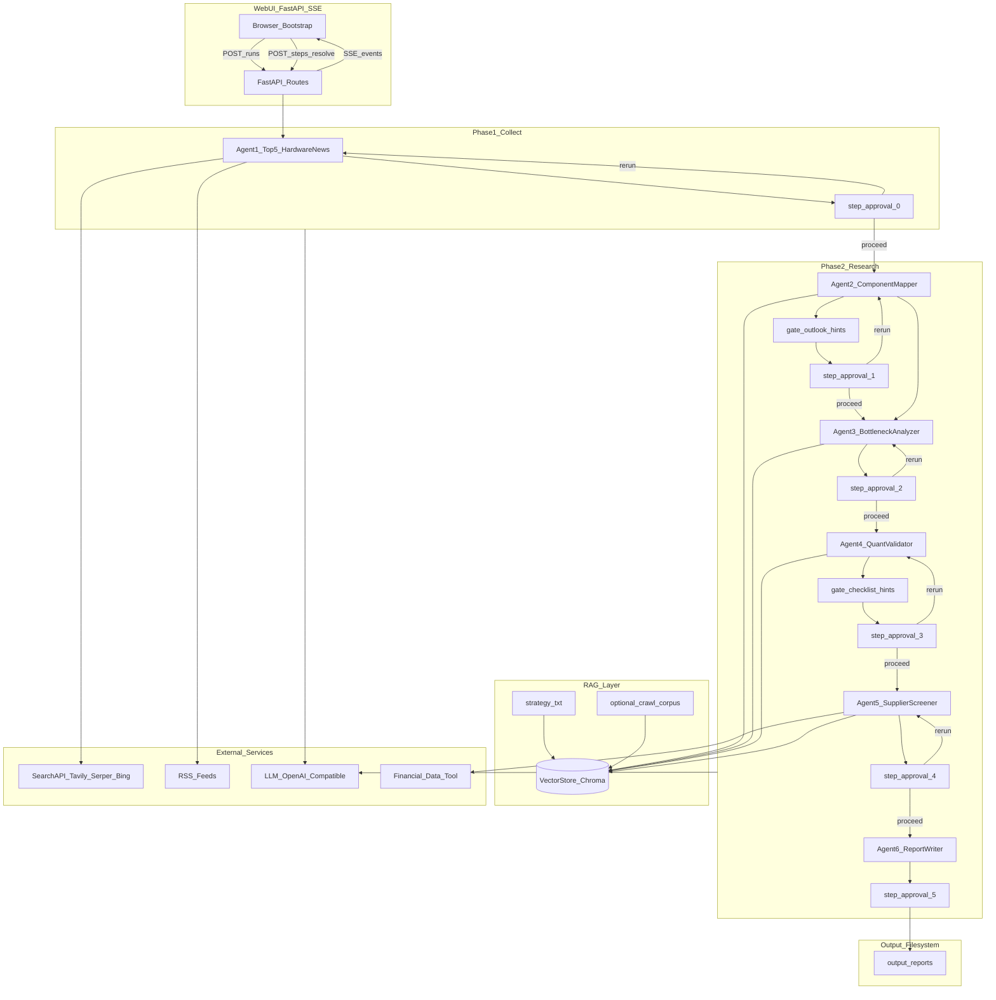

# Manus 产业链投研 Agent — 产品规格说明书（SPEC）

| 属性 | 值 |
|------|-----|
| 版本 | v1.4.1 |
| 状态 | Draft — 实现基线 |
| 项目路径 | `02_langgraph_agent助手/my_manus/` |
| 知识库 | `knowledge/strategy.txt`（v1.2） |
| 编排框架 | **Python Pipeline + RunManager**（RAG 层可用 LangChain / Chroma） |
| 交互方式 | FastAPI + SSE 网页端（**逐步人工确认**：每 Agent 完成后展示结果 → 用户满意则下一步 / 不满意则重跑当前步） |

---

## 第 1 章 项目概述

### 1.1 产品定位

Manus 产业链投研 Agent 是一套面向 **AI 产业硬件链** 的逆向 BOM 投研流水线。系统按 **单步执行 + 人工确认** 模式运行：**每个 Agent 完成后暂停**，在网页端展示当前步骤的结构化结果；用户 **满意则进入下一步**，**不满意则重跑当前 Agent**。Agent2 后仍有 **终端需求门槛门**、Agent4 后仍有 **检查清单门**（以提示形式呈现在确认面板中）。Agent6 汇总前五步结果生成 Markdown 报告并写入 `output/` 目录。

核心方法论来自 [`knowledge/strategy.txt`](../knowledge/strategy.txt)（产业链逆向拆解投资策略），通过向量 RAG 在各 Agent 节点按需检索注入，而非一次性全量塞入 prompt。

### 1.2 用户场景

| 场景 | 描述 |
|------|------|
| 逐步确认（核心） | **每个 Agent 跑完后** `status=awaiting_step_approval`，展示该步结果；用户 `proceed` 跑下一步或 `rerun` 重跑当前步 |
| 每日投研 Phase1 | 用户点击「采集热点」→ Agent1 完成 → 确认面板展示 Top5 |
| 选择研究方向 | Step0 确认时选定 `news_id` 并 `proceed`，触发 Agent2 |
| 深度研究 Phase2 | Agent2～6 每步完成后均暂停等待确认，不再批量串跑 |
| 指定日期回溯 | POST `/runs` 时传入 `run_date`，按该日新闻语境采集（默认当天） |
| 决策门提示 | Agent2 outlook=stop/uncertain、Agent4 checklist 硬项失败时，在确认面板展示 `approval_hints`，不替代人工确认 |
| 单步重跑 | `POST /steps/{step}/resolve { "action": "rerun" }` 或兼容 `POST /rerun?from=N` |
| A 股主板筛选 | Agent5 仅输出沪深主板标的，排除科创板/创业板/北交所/ST |
| 仅重生成报告 | Step5（Agent6）确认面板或 `POST /report/regenerate` |
| 历史查阅 | 浏览 `/runs` 列表，打开某次运行的 JSON 与 Markdown 报告 |

### 1.3 非目标（Out of Scope）

- 自动下单、实盘交易、组合管理
- 实时行情推送与高频交易信号
- 覆盖全部宏观因子（利率、选举、地缘等仅作风险提示，不进主逻辑）
- 替代人工最终投资决策（输出固定附带免责声明）
- **港股、美股、科创板/创业板/北交所标的纳入投资建议列表**（Agent5 仅 A 股主板）

### 1.4 参考项目与复用关系

| 参考 | 路径 | 复用 | 不照搬 |
|------|------|------|--------|
| OpenManus-gui | `参考/OpenManus-gui/` | FastAPI + SSE 任务流、TaskManager、`config.toml`、Bootstrap 前端 | ReAct 单 Agent 循环、GUI-Plus 浏览器为主路径 |
| OpenManus-rag | `参考/OpenManus-rag/` | `knowledge/` 目录约定、SOP 式文档结构 | 全量 prompt 注入（无向量检索） |
| strategy.txt | `knowledge/strategy.txt` | 六 Agent 方法论、检查清单、输出字段 | — |
| Web_Crawler | `Web_Crawler/` | `汇总2.md` 作为可选第二 RAG corpus | 爬虫不进主工作流 |

### 1.5 已确认的产品决策

- **Agent1 新闻源**：专用搜索 API（Tavily / Serper / Bing 可配置）+ 可选 RSS
- **Agent1 输出**：近 24h **AI 产业硬件向 Top5**（芯片/互连/存储/封装/物理 AI/特材等）
- **交互模式（v1.4）**：**逐步人工确认** — 每个 Agent 完成后暂停，`awaiting_step_approval`；满意 `proceed`，不满意 `rerun`
- **研究范围**：仅对用户所选 1 条热点做深度产业链研究，不并行研究全部 5 条
- **报告落盘**：Agent6 将完整 Markdown 报告写入项目 `output/reports/` 目录
- **编排选型**：Python Pipeline + RunManager；PipelineRunner **每次只执行一个 Agent**，执行完即暂停
- **决策门**：Agent2 gate_outlook、Agent4 gate_checklist 在对应步骤确认面板中以 `approval_hints` 展示，**不自动跳过确认**
- **重跑能力**：确认面板「不满意，重跑」= 仅重跑当前 `pending_approval_step` 对应 Agent
- **标的上市范围（Agent5）**：产业链相关公司 **仅纳入 A 股沪深主板上市公司**；**排除**科创板（688）、创业板（300）、北交所（8 开头）及 **ST / *ST** 股票

---

## 第 2 章 系统架构

### 2.1 架构总览



### 2.2 与 OpenManus 架构差异

| 维度 | OpenManus-gui/rag | 本项目 |
|------|-------------------|--------|
| 编排 | 单 Agent ReAct 循环 或 PlanningFlow | **Python Pipeline** 逐步执行 + 每步人工确认 + 决策门提示 |
| 知识 | 启动时全量注入 system prompt | 按 Agent 向量检索 top-k 注入 |
| 工具 | 通用（浏览器、Python、搜索） | 领域专用（新闻 API、财报查询）+ 少量通用 |
| 输出 | 自由文本 + 工具结果 | 强制 JSON Schema + 最终 Markdown 报告 |
| 状态持久化 | TaskManager 内存 + 可选文件 | RunManager + `runs/{run_id}/state.json`（无 LangGraph checkpoint） |

### 2.3 目标目录结构

```
my_manus/
├── docs/
│   └── SPEC.md                     # 本文档
├── knowledge/
│   └── strategy.txt                # 主 RAG 文档（已有）
├── app/
│   ├── main.py                     # FastAPI 入口
│   ├── cli.py                        # CLI 入口（§6.6）
│   ├── config.py                   # 配置加载（参考 OpenManus）
│   ├── llm.py                      # OpenAI-compatible LLM 封装
│   ├── pipeline/
│   │   ├── state.py                # PipelineState（原 GraphState）定义
│   │   ├── runner.py               # PipelineRunner：Phase1/2、门控、重跑路由
│   │   ├── gates.py                # gate_outlook、gate_checklist 判定
│   │   └── steps/
│   │       ├── agent1_news.py
│   │       ├── agent2_components.py
│   │       ├── agent3_bottleneck.py
│   │       ├── agent4_quant.py
│   │       ├── agent5_supplier.py
│   │       └── agent6_report.py    # 报告撰写 + 写入 output/（generate/regenerate）
│   ├── rag/
│   │   ├── ingest.py               # 分块 + embedding + 入库
│   │   ├── retriever.py            # 按 Agent 检索
│   │   └── store/                  # Chroma 持久化（gitignore）
│   ├── tools/
│   │   ├── search_news.py          # Tavily/Serper/Bing 适配器
│   │   ├── rss_fetch.py
│   │   ├── web_search.py           # 备用通用搜索
│   │   ├── python_execute.py       # 定量计算
│   │   ├── finance_lookup.py       # 财报/基本面（A 股）
│   │   └── supplier_screen.py      # A 股主板/ST 上市资格过滤
│   ├── prompts/                    # 各 Agent system/user 模板
│   └── schemas/                    # Pydantic 结构化输出
├── config/
│   ├── config.example.toml
│   └── config.toml                 # 本地配置（gitignore）
├── templates/
│   └── index.html
├── static/
│   ├── main.js
│   └── style.css
├── output/                           # 对外交付产物（gitignore 可选）
│   └── reports/                      # Agent6 生成的 Markdown 报告
│       └── {run_date}_{run_id}_{slug}.md
├── runs/                             # 运行态持久化（gitignore）
├── requirements.txt
└── Web_Crawler/                    # 已有，独立模块
```

### 2.4 数据流

```text
通用单步循环（PipelineRunner.run_single_step）：
  → 执行 Agent N
  → （若适用）运行内联门控，写入 approval_hints
  → status=awaiting_step_approval, pending_approval_step=N
  → SSE step_approval_required（含该步输出摘要）
  → 等待 POST /steps/{N}/resolve
  → action=proceed → 执行 Agent N+1（或 step0 proceed 时带 news_id 启动 Agent2）
  → action=rerun   → 重跑 Agent N，再次进入 awaiting_step_approval

Phase1 — POST /runs
  → run_single_step(run_id, step=0) → awaiting_step_approval(0)

Step0 确认 — POST /steps/0/resolve { action, news_id? }
  → proceed + news_id → 写入 selected_*，phase=research，执行 Agent2 → awaiting_step_approval(1)
  → rerun → 重跑 Agent1 → awaiting_step_approval(0)

Step1～5 确认 — POST /steps/{1..5}/resolve { action: proceed|rerun }
  → proceed → 执行下一步 Agent → awaiting_step_approval(step+1)
  → rerun   → 重跑当前 Agent

Step5 确认（Agent6）— POST /steps/5/resolve
  → proceed → status=completed
  → rerun   → 重跑 Agent6（generate 模式）
```

**步骤编号约定（全文统一）**：

- `step` = `pending_approval_step`，取值 **0～5**
- `agent = step + 1`（step0=Agent1 … step5=Agent6）
- API 路径 `/steps/{step}/resolve` 中 `{step}` 即为上表 step，**不存在 step6**

---

## 第 3 章 Pipeline 工作流设计

### 3.0 编排选型说明（v1.4）

| 方案 | 决策 |
|------|------|
| **Python Pipeline + RunManager** | **采用** — 每次只跑一个 Agent，跑完即 `awaiting_step_approval` |
| LangGraph | **不采用** — 逐步确认由 RunManager 暂停/恢复即可 |

**PipelineRunner 核心接口（v1.4）**：

```python
# app/pipeline/runner.py — 概念结构
class PipelineRunner:
    async def run_single_step(self, run_id: str, step: int) -> PipelineState:
        """执行单个 Agent（step 0～5），完成后置 awaiting_step_approval"""

    async def resolve_step(
        self, run_id: str, step: int, action: str, news_id: str | None = None
    ) -> PipelineState:
        """action=proceed → 跑 step+1；action=rerun → 重跑 step"""

    async def regenerate_report(self, run_id: str) -> PipelineState: ...

    def _build_approval_hints(self, state: PipelineState, step: int) -> ApprovalHints:
        """汇总 gate_outlook / gate_checklist 等提示，供确认面板展示"""

    def _apply_gate_outlook(self, state: PipelineState) -> None:
        """Agent2 完成后写入 approval_hints，不自动跳转"""

    def _apply_gate_checklist(self, state: PipelineState) -> None:
        """Agent4 完成后写入 approval_hints + checklist_gate"""
```

**执行纪律**：`run_phase2` / `run_from_step` 等批量接口 **废弃**；所有推进均由 `resolve_step` 触发下一步。

### 3.1 PipelineState 定义

全局状态使用 Pydantic `BaseModel`（`app/pipeline/state.py`），序列化至 `runs/{run_id}/state.json`。

| 字段 | 类型 | 读写 Agent | 说明 |
|------|------|------------|------|
| `run_id` | `str` | 初始化 | UUID，任务唯一标识 |
| `run_date` | `date` | 初始化 | 分析基准日期 |
| `phase` | `str` | 各步骤 | `collect` / `research` |
| `status` | `str` | 各步骤 | 见 3.1.1 status 枚举 |
| `pending_approval_step` | `int \| null` | 各步骤 | **0～5**，与 Agent1～6 一一对应（`agent = step + 1`） |
| `approval_hints` | `ApprovalHints \| null` | 门控/步骤 | 确认面板展示的警告与阻断提示 |
| `step_output_summary` | `str \| null` | 各 Agent | 当前步骤人类可读摘要（SSE/面板用） |
| `news_items` | `list[NewsItem]` | Agent1 写 | 硬件向 Top5 候选 |
| `selected_news_id` | `str \| null` | 用户/API 写 | 用户选定的 news_id |
| `selected_news_item` | `NewsItem \| null` | select API 写 | 选定条目的完整对象 |
| `component_node` | `ComponentNode \| null` | Agent2 写 | 所选方向的零部件拆解（单对象） |
| `bottlenecks` | `list[BottleneckItem]` | Agent3 写 | 卡点/瓶颈/错配 |
| `ripple_notes` | `str \| null` | Agent3 写 | 第三阶 ripple（strategy 13.2） |
| `validations` | `list[ValidationReport]` | Agent4 写 | 断供测试+定量+red_team |
| `red_team` | `RedTeamReport \| null` | Agent4 写 | strategy 九证伪清单 |
| `suppliers` | `list[SupplierProfile]` | Agent5 写 | 供应商筛选 |
| `suppliers_excluded` | `list[dict]` | Agent5 写 | 被 `supplier_screen` 过滤的候选（`ticker`, `reason`），供审计 |
| `checklist_gate` | `ChecklistGateResult \| null` | gate_checklist 写 | Agent4 后检查清单门判定结果 |
| `gate_outlook_result` | `str \| null` | gate_outlook 写 | `continue` / `stop` / `uncertain` |
| `confidence` | `str` | gate_checklist / Agent6 | `high` / `medium` / `low` — 报告整体置信度 |
| `rerun_from_step` | `int \| null` | rerun API 写 | 最近一次重跑起始步骤 |
| `agent6_mode` | `str` | Agent6 / regenerate API | `generate`（LLM 汇总）/ `regenerate`（纯模板） |
| `rag_contexts` | `dict[str, str]` | 各 Agent 写 | key=agent名, value=检索到的 strategy 片段 |
| `errors` | `list[str]` | 各步骤 | 非致命错误累积 |
| `final_report_md` | `str` | Agent6 写 | 完整 Markdown 报告正文 |
| `report_output_path` | `str \| null` | Agent6 写 | 落盘路径 |

#### 3.1.1 status 枚举（v1.4.1）

| status | 含义 | 可转入 |
|--------|------|--------|
| `pending` | run 已创建，尚未开始 | `running` |
| `running` | 某 Agent 执行中 | `awaiting_step_approval` / `failed` |
| `awaiting_step_approval` | **某 Agent 刚完成，等待用户确认** | `running`（resolve proceed/rerun） |
| `completed` | 全部 6 步确认完成（含 Agent6 落盘） | `running`（rerun/regenerate） |
| `failed` | 致命异常 | `running`（rerun） |

**v1.3 状态迁移**：`awaiting_selection`、`awaiting_confirmation`、`awaiting_review` 统一合并为 `awaiting_step_approval`，由 `pending_approval_step` + `approval_hints` 区分场景。

**pending_approval_step 与 Agent 对照**：

| step | Agent | 确认面板展示字段 | proceed 行为 |
|------|-------|------------------|--------------|
| 0 | Agent1 | `news_items` Top5 | 需 `news_id`，启动 Agent2 |
| 1 | Agent2 | `component_node` + outlook 提示 | 执行 Agent3 |
| 2 | Agent3 | `bottlenecks`, `ripple_notes` | 执行 Agent4 |
| 3 | Agent4 | `validations`, `red_team`, checklist 提示 | 执行 Agent5 |
| 4 | Agent5 | `suppliers` | 执行 Agent6 |
| 5 | Agent6 | `final_report_md`, `report_output_path` | `status=completed` |

> `pending_approval_step` 取值 0～5，与 Agent1～6 一一对应。Agent6 完成后为 5，用户 confirm 后任务结束。

### 3.2 步骤与路由（逐步确认）

```text
START
  → agent1_news (step=0)           → [PAUSE] awaiting_step_approval(0)
  → [resolve proceed + news_id]
  → agent2_components (step=1)     → gate_outlook → [PAUSE] awaiting_step_approval(1)
  → agent3_bottleneck (step=2)     → [PAUSE] awaiting_step_approval(2)
  → agent4_quant (step=3)          → gate_checklist → [PAUSE] awaiting_step_approval(3)
  → agent5_supplier (step=4)       → [PAUSE] awaiting_step_approval(4)
  → agent6_report (step=5)         → [PAUSE] awaiting_step_approval(5)
  → [resolve proceed]              → END (completed)
```

**单步暂停机制**：

```python
# 每个 Agent 执行后
state.status = "awaiting_step_approval"
state.pending_approval_step = step
state.step_output_summary = build_summary(state, step)
state.approval_hints = build_approval_hints(state, step)
await persist(state)
await emit(run_id, "step_approval_required", {...})
# 阻塞直至 POST /steps/{step}/resolve
```

- `POST /runs`：仅触发 `run_single_step(run_id, step=0)`
- 任意步 `resolve action=proceed`：校验 `pending_approval_step == step`，再 `run_single_step(run_id, step+1)` 或 step0 时先写 selected 再跑 step1
- 任意步 `resolve action=rerun`：清除该步输出（及下游），`run_single_step(run_id, step)`

#### 3.2.1 gate_outlook（嵌入 Step1 确认面板 — strategy 三）

Agent2 完成后**不自动分支**，仅写入 `approval_hints`：

| `outlook_2_3y` | approval_hints | proceed 按钮 |
|----------------|----------------|--------------|
| `continue` | 无阻断 | 正常「满意，下一步」 |
| `uncertain` | `outlook_uncertain: true` + 原因 | 可 proceed（用户自担风险）或 rerun |
| `stop` | `block_proceed: true` + 停止原因 | **禁用 proceed**；仅「重跑 Agent2」或「返回重选方向」 |

- 「返回重选方向」：`POST /steps/1/resolve { "action": "change_direction" }` → 清空 Phase2 字段，`pending_approval_step=0`，保留 `news_items`

#### 3.2.2 gate_checklist（嵌入 Step3 确认面板 — strategy 十）

Agent4 完成后写入 `checklist_gate` 与 `approval_hints`，**等待用户确认**：

| 门控结果 | approval_hints | 用户选项 |
|----------|----------------|----------|
| 硬项全过 | 无 | proceed / rerun |
| 仅软项失败 | `confidence_low: true` | proceed / rerun |
| 硬项失败 | `checklist_hard_fail: true` + 失败项列表 | proceed（接受不完整）/ rerun Agent4 / `change_direction` 回 step2 |

自动重试 Agent4（`gate_checklist_auto_retry`）仍在 Agent4 **执行阶段**内完成，重试后再次进入 `awaiting_step_approval(3)`。

**并发规则**：

- `awaiting_step_approval` 允许多 run 并存
- 同实例仅一个 `status=running` 的 Agent 任务

**`step_approval_required=false`（全自动模式）**：

- Agent1～6 **连续执行**，不在每步暂停；仅 step0 仍需 `news_id`（通过 `resolve` 或 CLI `--news-id` 一次提交）
- `gate_outlook` / `gate_checklist` 仍写入 `approval_hints`，在最终报告与 `run_complete` SSE 中展示，不阻断执行

### 3.2.3 步骤确认与重跑 API 映射

| 用户操作 | API | 效果 |
|----------|-----|------|
| 满意，下一步 | `POST /steps/{step}/resolve { "action": "proceed" }` | 执行 step+1 对应 Agent |
| Step0 满意并选方向 | `POST /steps/0/resolve { "action": "proceed", "news_id": "..." }` | 写入 selected，执行 Agent2 |
| 不满意，重跑 | `POST /steps/{step}/resolve { "action": "rerun" }` | 仅重跑该 step Agent |
| 重选方向（step1 stop） | `POST /steps/1/resolve { "action": "change_direction" }` | 回 step0 确认面板 |
| 兼容旧接口 | `POST /rerun?from=N` | `from` 为 step（0～5）；若传 `agent`（1～6）则 `step=agent-1` |

### 3.2.5 重跑 / 换向字段清除矩阵

`resolve action=rerun` 或 `change_direction` 时，在重新执行 Agent 前清除下列字段：

| step | action | 清除字段 |
|------|--------|----------|
| 0 | rerun | 无（仅重跑 `news_items`） |
| 1 | rerun | `component_node` 及以下 Phase2 全清 |
| 2 | rerun | `bottlenecks`, `ripple_notes` 及以下 |
| 3 | rerun | `validations`, `red_team`, `checklist_gate`, `confidence` 及以下 |
| 4 | rerun | `suppliers` 及以下 |
| 5 | rerun | `final_report_md`, `report_output_path`, `agent6_mode` |
| 1 | change_direction | `selected_*` + 上表 step≥1 全部字段；`phase=collect`；回 `pending_approval_step=0` |
| 3 | change_direction | step≥2 字段；回 `pending_approval_step=2`（保留 Agent1～3 结果） |

保留字段：`run_id`, `run_date`, `news_items`（除非 step0 rerun）、`errors`（追加不清空）、`rag_contexts`（可选按 step 清除对应 key）。


| 项目 | v1.4 | v1.4.1 |
|------|------|--------|
| step 编号 | 混用 0～6 / step6 API | **统一 0～5**，`agent=step+1` |
| 降级行为 | 部分描述自动下一步 | **暂停当步确认** + `approval_hints.degraded` |
| deepen_bom | 自动重跑 | **仅 hints + 用户 rerun** |
| Agent5 标的 | — | **A 股沪深主板** + `supplier_screen` |
| 附录 | — | StepResolveRequest / StepApprovalView / 字段清除矩阵 |

| 项目 | v1.3 | v1.4 |
|------|------|------|
| 步骤推进 | Phase2 批量串跑 | **每 Agent 后暂停确认** |
| 主 status | 多种 awaiting_* | 统一 `awaiting_step_approval` |
| 主 API | /select, /confirm, /rerun | **`/steps/{step}/resolve`** |
| 决策门 | 自动分支 | **嵌入确认面板 hints** |

### 3.3 错误处理与降级策略

| 异常类型 | 处理 |
|----------|------|
| LLM JSON 解析失败 | 同 prompt 重试 1 次（`workflow.max_retries`） |
| 重试仍失败 | 写入 `errors[]` + 降级输出（`degraded_summary`）；**仍进入 `awaiting_step_approval`**，`approval_hints.degraded=true`；由用户 rerun 或带降级 proceed |
| gate_outlook stop | `approval_hints.block_proceed=true`，确认面板禁用 proceed |
| gate_checklist hard_fail | 写入 hints；用户可 proceed 或 rerun，**不自动跳步** |
| 搜索 API 超时 | 降级为 RSS-only；RSS 也失败则 Agent1 输出占位新闻 + error |
| RAG 检索为空 | 使用预置 fallback 摘要（strategy 第二章七步流程硬编码片段） |
| finance_lookup 失败 | SupplierProfile.financials 标记 `unavailable`，仍输出定性分析 |
| Agent6 写文件失败 | 写入 `errors[]`，`final_report_md` 仍保留在 state；SSE `agent_error`；`report_output_path=null` |
| 任一步致命异常 | `status=failed`，SSE 推送 `run_error`，保留已完成的中间 state |

### 3.4 strategy.txt 章节映射（v1.4.1）

| Pipeline 步骤 | strategy.txt 章节 | 职责摘要 |
|---------------|-------------------|----------|
| Agent1 NewsCollector | 一（定位）、三（终端需求门槛） | 采集今日 AI 产业**硬件向 Top5** 热点，供用户选 1 方向 |
| gate_outlook | **三（终端需求门槛）** | `stop` 则不拆；`uncertain` 人工确认 |
| Agent2 ComponentMapper | **四（产业链拆解）、4.3（横向延伸）** | 所选 1 条 → BOM + `horizontal_branches` |
| Agent3 BottleneckAnalyzer | 五（卡点/瓶颈/错配）、**13.2（三阶涟漪）、13.4（瓶颈地图）** | 向上游识别 oligopoly、扩产慢、供需错配 |
| Agent4 QuantValidator | 5.3、六、**九（AI 挑漏洞/red-team）**、十（检查清单输入） | 断供测试 + 定量 + `red_team` + checklist 条目 |
| gate_checklist | **十（检查清单决策门）** | 硬项失败暂停或重跑 Agent4 |
| Agent5 SupplierScreener | 七、八（摘要）、**13.5**、**4.5.1 A股主板** | A 股主板供应商筛选与财务 |
| Agent6 ReportWriter | 十、十一、十二 | 汇总 Agent1～5，generate/regenerate 报告落盘 |

#### 3.4.1 strategy 第十三章子节 → Agent 职责

| 子节 | 内容 | 负责 Agent / 门 |
|------|------|-----------------|
| 13.1 定价节奏与仓位 | 逻辑验证→催化剂→加仓 | Agent5 摘要 + Agent6 报告「节奏提示」 |
| 13.2 三阶涟漪 | 出口管制、地缘连带 | Agent3 `ripple_notes`；Agent4 red_team 引用 |
| 13.3 市场重定价规则 | 叙事 vs 基本面 | Agent4 counter_evidence |
| 13.4 瓶颈主题地图 | 光电子/存储/MLCC 等 | Agent2 RAG + Agent3 横向扫描 |
| 13.5 研究渠道 | A 股公告/年报、主板 hidden gem | Agent5 `research_channels_used` |
| 13.6 额外检查项 | 地缘、时序、验证、**主板小市值流动性** | gate_checklist 软项 + Agent6 报告 |

---

## 第 4 章 六 Agent 详细规格

每个 Agent 统一包含：**职责 / 输入 / 输出 / 工具 / RAG / Prompt 要点 / 质量门槛**。

---

### 4.1 Agent1 — NewsCollector（今日 AI 硬件向 Top5）

#### 职责

从专用搜索 API 与 RSS 源采集近 24 小时内 **AI 产业硬件向** 热点，去重排序后输出 Top 5，供用户在网页端选择 1 个方向做深度产业链研究。

#### 硬件向筛选标准

**纳入**（`hardware_focus=true`）：

- 半导体制造 / 先进封装（CoWoS、CoPoS、hybrid bonding、glass substrate）
- 算力芯片、HBM / DRAM / NAND、存储控制器
- 互连 / 光电子（CPO、1.6T、InP 基板、硅光）
- AI 数据中心硬件（电源、液冷、CDU、800V DC）
- 物理 AI 核心部件（执行器、传感器、边缘算力模组）
- 关键材料 / 特气 / 被动元件（MLCC、WF6、稀土加工等）

**排除**：

- 纯软件 / SaaS / 模型发布（无硬件 BOM 含义）
- 纯融资 / 人事 / 监管（除非直接影响硬件供应链）
- 消费级 AI 应用（无产业链拆解价值）

#### 输入

- `run_date`: 分析日期
- `config.search`: provider、api_key、rss_feeds

#### 输出

- `news_items`: `list[NewsItem]`，长度固定为 **5**（不足 5 条时填充 degraded 占位并记 error）
- 每条须含 `hardware_focus`、`hardware_tags`、`research_hint`

#### 工具

| 工具 | 签名 | 说明 |
|------|------|------|
| `search_news` | `(query, provider, max_results, days=1)` | Tavily/Serper/Bing 统一适配 |
| `rss_fetch` | `(feeds: list[str], since: datetime)` | 解析 RSS/Atom |
| `dedupe_and_rank` | `(items: list, top_n=5)` | URL/title 相似度去重 + 排序 |

#### 搜索策略

1. 并行执行 5～6 组**硬件加权** query（见下表）
2. 合并 RSS 结果
3. 过滤：`published_at` 在 `run_date` 前 24h 内
4. 硬件相关性标签：`算力`、`互连`、`存储`、`CPO`、`HBM`、`封装`、`Physical AI`、`数据中心`、`半导体`、`特气`、`MLCC` 等
5. 排序：`heat_score = 0.35*hardware_relevance + 0.25*source_authority + 0.25*recency + 0.15*general_relevance`
6. 优先保留 `hardware_focus=true` 的条目，取 Top 5

**默认搜索 query 模板**：

```text
AI semiconductor hardware breakthrough news {run_date}
AI datacenter GPU HBM supply chain news today
CPO photonics silicon photonics hardware news
AI robot actuator sensor hardware news
advanced packaging CoWoS memory bottleneck news
semiconductor equipment lithography packaging news
```

#### 默认 RSS 源（可配置）

| 名称 | URL 示例 |
|------|----------|
| Semiconductor Engineering | `https://semiengineering.com/feed/` |
| Ars Technica AI | `https://feeds.arstechnica.com/arstechnica/technology-lab` |
| 机器之心 | `https://www.jiqizhixin.com/rss` |
| The Verge AI | `https://www.theverge.com/rss/ai-artificial-intelligence/index.xml` |

#### RAG 检索

见第 5 章 Agent1 行。

#### System Prompt 要点

- 角色：AI **硬件产业链** 新闻分析师
- 任务：筛选对「逆向 BOM 拆解」有价值的**硬件技术/进展**，而非泛科技八卦
- 约束：必须输出 5 条；每条含可访问 URL；中文摘要；至少 4 条 `hardware_focus=true`
- 每条须提供 `research_hint`：若用户选此方向，可拆什么 BOM
- 注入：RAG 检索到的 strategy 第一、二、三章片段

#### 质量门槛

- [ ] 5 条新闻均有 `url` 和 `published_at`
- [ ] 至少 **4 条** `hardware_focus=true`
- [ ] 每条 `hardware_tags` 非空
- [ ] 每条 `research_hint` 非空
- [ ] 非硬件向条目不得超过 1 条

---

### 4.2 Agent2 — ComponentMapper（零部件推演）

#### 职责

将用户 **所选 1 条** 热点（`selected_news_item`）还原为「终端需求 → 物理系统零部件清单」，遵循 strategy 第四章拆解方法。

#### 输入

- `selected_news_item`: 单条 NewsItem（必填）
- `selected_news_id`: 校验用
- `rag_contexts["agent2"]`

#### 输出

- `component_node`: 单个 `ComponentNode`（对应所选 news_id）
- `horizontal_branches`: `list[HorizontalBranch]`（strategy 4.3 横向延伸，供 Agent3 优先扫描）

#### 工具

无外部工具，纯 LLM + RAG structured output。

#### 拆解方法（强制）

对所选新闻：

1. 判断 `terminal_demand`（2～3 年是否会延续，引用新闻中的背书）
2. 按 4.1 物理系统分类列出 components：
   - `core_module` — 核心功能模块
   - `interconnect` — 互连/传输/接口
   - `power_thermal` — 供电、散热
   - `materials_equipment` — 特种材料、测试与设备
3. 每个 component 填 `value_share`（高/中/低）、`growth_driver`、`upstream_hints`
4. **深度要求**：比新闻表面多拆 1 层
   - 反例：CPO 新闻只列 NVDA
   - 正例：CPO → FAU / CW激光 / InP基板 / 光引擎 / 连接器热管理
5. **横向延伸（strategy 4.3）**：输出至少 1 条 `horizontal_branches`：
   - `isomorphic` — 同构部件（系统除 A 外还必需 B、C）
   - `upstream_material` — 上游物料（中间品 BOM 再向上）
   - `substitution` — 替代/挤压（高端紧缺→低端/国产/相邻品类）

#### gate_outlook 联动

Agent2 完成后 PipelineRunner 调用 `gate_outlook`，结果写入 `approval_hints`（**不自动跳转**）。用户在 Step1 确认面板决定 proceed / rerun / change_direction。

#### RAG 检索

见第 5 章 Agent2 行。

#### System Prompt 要点

- 工程师思维，输出 BOM 而非股票推荐
- **仅分析 selected_news_item**，不涉及 Top5 中未选条目
- 引用 strategy 4.2「不要停在共识层级」
- 对 `terminal_demand` 明确「会停/不会停」及依据
- 输出严格 JSON

#### 质量门槛

- [ ] 至少 4 个 components，覆盖 ≥2 个 category
- [ ] 至少 1 个 component 的 `upstream_hints` 比新闻原文更深一层
- [ ] `terminal_demand` 含 `outlook_2_3y` 字段（continue / stop / uncertain）
- [ ] 至少 1 条 `horizontal_branches`（strategy 4.3）
- [ ] `decomposition_depth >= 3`（终端→模块→器件 语义层级）
- [ ] `component_node.news_id` 等于 `selected_news_id`

---

### 4.3 Agent3 — BottleneckAnalyzer（卡点/瓶颈/供需错配）

#### 职责

对 `component_node` 中的所有 components，向上游再拆 1～2 层，识别满足 strategy 5.1 四特征的瓶颈环节。

#### 输入

- `component_node`（含 `horizontal_branches`）
- `selected_news_item`（上下文）
- `rag_contexts["agent3"]`

#### 输出

- `bottlenecks`: 去重后的 BottleneckItem 列表（建议 5～15 条）
- `ripple_notes`: 第三阶 ripple 说明（strategy 13.2，出口管制/地缘连带）

#### 工具

- `web_search`（可选，补充供应商数量、扩产新闻）

#### 分析方法

对每个 upstream hint **及 horizontal_branches 节点**：

1. 评估四特征（刚需、寡头、扩产慢、低覆盖），每条 true/false/unknown
2. 满足 ≥2 条 true 的进入候选
3. 填写 `mismatch_hypothesis`（需求跳升 + 供给跟不上）
4. 估算 `supplier_count_est`、 `expansion_cycle_months`
5. 引用 `evidence[]`（新闻、行业常识、RAG 案例）

#### RAG 检索

见第 5 章 Agent3 行；可选第二 corpus `汇总2.md` 补充实战案例。

#### System Prompt 要点

- 优先找「同时满足越多越好」的环节（strategy 5.1）
- 考虑第三阶 ripple（strategy 13.2）：出口管制、地缘连带
- 引用 13.4 瓶颈地图作横向联想
- 不输出 ticker，只输出环节名称与层级；**公司名仅作产业链参考，A 股标的映射由 Agent5 完成**

#### 质量门槛

- [ ] 每条 BottleneckItem 四特征均有评分
- [ ] 至少 3 条 bottleneck 满足 ≥3 个 true
- [ ] `layer` 字段标明在 BOM 中的层级（module/device/material/process）
- [ ] 若 bottleneck 数量 < 2，在 step2 确认面板设置 `approval_hints.suggest_deepen_bom=true`；**不自动重跑**；用户 `rerun` step2 时 PipelineRunner 注入「比共识多拆一层」prompt（`workflow.max_deepen_retries=1`）

---

### 4.4 Agent4 — QuantValidator（断供测试 + 定量分析 + Red-team）

#### 职责

对 Agent3 的 bottlenecks 逐一执行断供测试（strategy 5.3 四问）和定量分析（strategy 第六章）；完成后执行 **red_team 子步骤**（strategy 第九章：专门挑漏洞、列出证伪所需数据）；输出供 `gate_checklist` 判定的 checklist 条目。

#### 输入

- `bottlenecks`
- `component_node`
- `rag_contexts["agent4"]`

#### 输出

- `validations`: ValidationReport 列表，与 bottlenecks 1:1 或合并相近项
- `red_team`: RedTeamReport（run 级，见 A.7）— 替代路线、技术颠覆、供给响应、证伪数据清单

#### 工具

| 工具 | 用途 |
|------|------|
| `python_execute` | 计算 gap_ratio、price_elasticity 等 |
| `web_search` | 补充公开产能、扩产公告、行业报告数据 |

#### 断供测试四问（映射到字段）

| 问题 | 输出字段 |
|------|----------|
| 下游是否必须改架构？ | `supply_test.architecture_change_required` |
| 换供应商需多久？ | `supply_test.switching_time_months` |
| 下游是否在囤货？ | `supply_test.hoarding_signals` |
| 切换成本是否极高？ | `supply_test.switching_cost` |

综合评分：`irreplaceability_score` 1～5（5=拿掉则行业停摆）

#### 定量字段（strategy 6.1）

| 字段 | 说明 |
|------|------|
| `supply_capacity` | 当前全球产能（数值+单位+来源） |
| `demand_estimate` | 下游需求推导 |
| `gap_ratio` | 缺口占需求比例 0～1 |
| `duration_quarters` | 预计持续季度数 |
| `price_elasticity` | 涨价对毛利率/净利弹性（定性+定量） |
| `assumptions` | 关键假设列表 |
| `checklist_pass` | strategy 第十章 + 13.6 适用项勾选 |

#### Red-team 子步骤（strategy 九）

在 validations 生成后，单独 prompt 执行 red_team（同一 Agent4 步骤内，不新增 Agent）：

1. 列出 3～5 条**替代路线 / 技术颠覆**可能
2. 列出「若要证伪本逻辑，需要哪些数据」（`falsification_data_needed`）
3. 评估供给响应速度（扩产、良率突破是否超预期）
4. 输出 `needs_human_review: bool` — 若 true，在 Step3 确认面板 `approval_hints` 中突出显示

#### gate_checklist 联动

Agent4 完成后写入 `checklist_gate` 与 `approval_hints`，进入 `awaiting_step_approval(3)`。用户在确认面板选择 proceed / rerun / change_direction（回 step2）。

#### RAG 检索

见第 5 章 Agent4 行。

#### System Prompt 要点

- 定性链条必须落到数字（strategy 6.3 纪律）
- 无法获取精确数字时，给出区间估计并标注 `assumption`
- **Red-team 专责找错**（strategy 第九章）：不得与主分析共用同一「确认偏误」语气
- 用 AI 找漏洞：列出证伪所需数据，写入 `red_team.falsification_data_needed`
- 输出 `irreplaceability_score < 3` 的项仍保留，但 Agent5 将跳过

#### 质量门槛

- [ ] 每条 validation 完成断供测试四问
- [ ] 至少 50% 的项有 numeric `gap_ratio` 或明确区间
- [ ] `checklist_pass` 至少勾选 6/10 项
- [ ] `red_team` 含 ≥3 条 `falsification_data_needed`
- [ ] 全项 `irreplaceability_score < 3` 时仍输出报告，但 `confidence=low` 且跳过 Agent5

---

### 4.5 Agent5 — SupplierScreener（供应商筛选与财务分析）

#### 职责

对 `irreplaceability_score >= 3` 的瓶颈，在 **A 股沪深主板上市公司** 范围内筛选供应商（见 4.5.1），分析产业方向与财务状况。

#### 4.5.1 A 股上市范围约束（硬规则）

Agent5 输出的 `suppliers[]` **仅允许**同时满足以下条件的标的：

| 条件 | 规则 |
|------|------|
| 市场 | **A 股**已上市（`market=CN`） |
| 板块 | **沪深主板** only |
| 排除科创板 | 代码 `688` 开头（`.SH`） |
| 排除创业板 | 代码 `300` 开头（`.SZ`） |
| 排除北交所 | 代码 `8` 开头（`.BJ`，含 43/83/87/88/92 等） |
| 排除 ST | 简称或全称含 `ST`、`*ST`、`S*ST`、`SST`（不区分大小写） |

**允许的股票代码前缀（主板）**：

| 交易所 | 前缀 | 示例 |
|--------|------|------|
| 上交所主板 | `600` / `601` / `603` / `605` | `600519.SH` |
| 深交所主板 | `000` / `001` / `002` | `000001.SZ` |

> `002` 原中小板已并入深交所主板，**保留**在允许范围；`688`/`300`/北交所 **一律不得**进入 `suppliers`。

**未上市或仅港股/美股上市**：不得写入 `suppliers`；若产业链相关但无符合条件 A 股标的，在该 `bottleneck_id` 下输出 0 家，并写入 `errors[]`：`no_eligible_a_share_main: {bottleneck_name}`。报告「4. 供应商候选」保留表头，标注「本瓶颈无合格 A 股主板标的」。

#### 4.5.2 上市资格边界（工程规则）

| 场景 | 处理 |
|------|------|
| ST / *ST 判断 | 以 **akshare 实时证券简称 + 风险警示板字段** 为准，不仅靠名称 regex |
| 退市整理 / 暂停上市 | `supplier_screen` 查交易状态，排除并记入 `errors[]` |
| 注册制新股 | 默认 **上市满 `supplier_screen.min_listing_days`（默认 60）交易日** 后才可纳入；可配置 |
| 被过滤候选 | 可选写入 `suppliers_excluded[]`（`ticker`, `reason`）供确认面板审计，不进正式 `suppliers` |

**工具契约**：

```python
# app/tools/finance_lookup.py
def finance_lookup(ticker: str) -> Financials:
    """A 股 ticker → 财务字段；失败抛 FinanceLookupError"""

# app/tools/supplier_screen.py
def is_eligible_a_share_main(ticker: str, company_name: str, meta: dict | None) -> tuple[bool, str]:
    """meta 含 akshare 交易状态、上市日期、ST 标记"""

def filter_suppliers(candidates: list[SupplierProfile]) -> tuple[list, list[str], list[dict]]:
    """返回 (合格 suppliers, errors, suppliers_excluded)"""
```

| 配置项 | 默认 | 说明 |
|--------|------|------|
| `finance.cache_ttl_sec` | 3600 | 同日重复 lookup 走缓存 |
| `finance.max_retries` | 2 | 非交易日/限流退避 |
| `supplier_screen.min_listing_days` | 60 | 新股冷却期 |

#### 输入

- `validations`（filtered）
- `bottlenecks`（join by bottleneck_id）
- `rag_contexts["agent5"]`

#### 输出

- `suppliers`: SupplierProfile 列表（每个 bottleneck 1～3 家候选）
- `suppliers_excluded`: 被过滤候选列表（可选，供 step4 确认面板展示）
- `research_channels_used`: 本次使用的研究渠道摘要（strategy 13.5）

#### 工具

| 工具 | 用途 |
|------|------|
| `finance_lookup` | A 股 ticker（`600519.SH`）→ 营收、毛利率、现金流、负债、市值 |
| `supplier_screen` | 硬过滤：主板 / 排除科创板创业板北交所 / 排除 ST |
| `web_search` | 业务构成、客户、扩产公告、coverage 信息（检索词限定「A股」「主板」） |

#### 筛选标准（strategy 第七章 + 4.5.1）

0. **上市资格**：通过 `supplier_screen`；不合格候选不进入 `suppliers`
1. 业务高度聚焦于该瓶颈（`business_focus_pct` 估算）
2. 市值相对小、低覆盖（`coverage_level`: high/medium/low）
3. 财务排雷：现金流、客户集中度、关联交易、稀释风险
4. 优先「纯血标的」而非多元化巨头的一小块业务

#### 补充启发（strategy 13.5，A 股范围内）

- 主板小市值、低覆盖、hidden gem（年报/公告逆向阅读）
- 流动性与市值匹配仓位；**不再检索美股 SEC / 韩股作为正式标的来源**

#### RAG 检索

见第 5 章 Agent5 行。

#### System Prompt 要点

- **仅输出 A 股沪深主板**合格标的；`ticker` 格式 `代码.交易所`（如 `603986.SH`）
- 禁止输出科创板 688、创业板 300、北交所 8 开头、ST 类股票
- 必须含 `risks[]` 和 `catalysts[]`
- 固定结尾免责声明：「本输出为研究辅助，不构成投资建议」
- 遵循 strategy 第九章：AI 辅助研究，结论需人审

#### 质量门槛

- [ ] 每个高分 bottleneck 至少 1 家 supplier **或** `errors` 中说明无合格 A 股主板标的
- [ ] 每家 supplier：`market=CN`、`listing_board=main`、`is_st=false`
- [ ] 每家 supplier 的 `ticker` 通过 `supplier_screen` 校验
- [ ] 每家 supplier 含 `business_focus_pct` 和 `financials` 或 `financials.unavailable` 说明

---

### 4.6 Agent6 — ReportWriter（报告撰写与落盘）

#### 职责

读取 Agent1～5 在 PipelineState 中的全部结构化输出，生成一份完整、可读的中文 Markdown 投研报告，写入项目 **`output/reports/`** 目录，并同步填充 `final_report_md` 供网页展示与 API 返回。

支持两种模式（`agent6_mode`）：

| 模式 | 触发 | 行为 |
|------|------|------|
| `generate` | Phase2 正常结束 | LLM 将 JSON 转为 Markdown（现有逻辑） |
| `regenerate` | `POST /runs/{id}/report/regenerate` | **纯 Jinja2 模板**填充已有 state，不调用 LLM，不重新跑 Agent1～5 |

#### 输入

- `run_id`, `run_date`, `agent6_mode`
- `news_items`, `selected_news_id`, `selected_news_item`
- `component_node`, `bottlenecks`, `validations`, `suppliers`, `red_team`, `checklist_gate`, `confidence`
- `errors`（写入报告「风险与边界」节）
- `rag_contexts["agent6"]`（仅 `generate` 模式，用于检查清单与免责声明措辞）

#### 输出

- `final_report_md`: 完整 Markdown 字符串
- `report_output_path`: 落盘文件路径

#### 工具

| 工具 | 签名 | 说明 |
|------|------|------|
| `write_report_file` | `(content: str, path: Path) -> str` | UTF-8 写入，自动创建目录 |
| `slugify_title` | `(title: str) -> str` | 文件名安全化 |
| `render_report_template` | `(state: PipelineState, template: str) -> str` | **regenerate** 模式专用 |

**不调用**外部搜索或财报 API；`generate` 模式仅基于前五步已有数据撰写，避免引入新事实。

#### 报告结构

严格遵循第 8.2 节模板，章节顺序：

1. 元信息（run_id、日期、所选方向、生成时间）
2. 执行摘要
3. 附录 A：Top5 候选（标注所选）
4. 所选方向：终端需求 + 零部件拆解
5. 瓶颈环节清单
6. 断供测试与定量分析
7. 供应商候选
8. 策略检查清单（strategy 第十 + 13.6 章）+ `checklist_gate` 判定摘要
9. Red-team 摘要（strategy 九，`red_team` 字段）
10. 风险与边界 + 免责声明（含 `confidence` 标注）

#### 落盘规则

**目录**：`{project_root}/output/reports/`（可通过 `config.output.reports_dir` 配置）

**文件名**：

```text
{run_date}_{run_id前8位}_{slug}.md
```

示例：`2026-07-07_a1b2c3d4_cpo-16t-mass-production.md`

- `slug` 取自 `selected_news_item.title`，最长 40 字符，小写连字符
- 若同名文件已存在，追加 `_001`、`_002` 后缀

**写入流程**：

```python
reports_dir = Path(config.output.reports_dir)
reports_dir.mkdir(parents=True, exist_ok=True)
path = reports_dir / build_filename(state)
path.write_text(final_report_md, encoding="utf-8")
state["report_output_path"] = str(path)
```

**双写策略**：

| 路径 | 用途 |
|------|------|
| `output/reports/{filename}.md` | **主交付物**，便于 RAG 入库、人工阅读、版本管理 |
| `runs/{run_id}/report.md` | 运行副本，与 `state.json` 同目录便于调试 |

#### RAG 检索

见第 5 章 Agent6 行（检查清单、风险边界、免责声明）。

#### System Prompt 要点

- 角色：投研报告编辑，将 JSON 结构化结果转为专业 Markdown
- **禁止编造**前五步未出现的公司、数字或结论
- 表格化呈现 bottlenecks、validations、suppliers
- 对缺失字段标注「数据 unavailable」而非留空
- 必须包含固定免责声明（第 8.2 节末尾）
- 中文为主，ticker / 技术缩写保留英文

#### 质量门槛

- [ ] `final_report_md` 长度 ≥ 2000 字符（regenerate 模式 ≥ 1500）
- [ ] 包含第 8.2 节全部一级章节（regenerate 允许「执行摘要」为模板句）
- [ ] `report_output_path` 文件存在且 UTF-8 可读
- [ ] 附录 A 列出全部 5 条 Top5 并标注所选
- [ ] 文末含免责声明；`confidence=low` 时在摘要显式标注

#### SSE 完成事件

Agent6 完成后推送：

```json
{
  "event": "agent_complete",
  "agent": 6,
  "agent_name": "ReportWriter",
  "summary": "报告已写入 output/reports/...",
  "report_output_path": "output/reports/2026-07-07_a1b2c3d4_xxx.md"
}
```

---

## 第 5 章 RAG 设计

### 5.1 设计决策

OpenManus-rag 采用启动时全量注入 `knowledge/*.txt`。本项目 strategy.txt（385 行 + 实战章）采用 **按 Agent 检索的向量 RAG**，原因：

- 各 Agent 所需章节不同，全量注入浪费 token
- 第十三章 + 可选 `汇总2.md` 体积大，需 selective retrieval
- 便于后续增量更新单章节而不重启服务

### 5.2 索引流程

```text
knowledge/strategy.txt
  → 按 ## / ### 标题切分 chunk
  → metadata: { source, section_id, title, level }
  → OpenAI-compatible embedding
  → 写入 Chroma（app/rag/store/）

可选: Web_Crawler/output/aleabitoreddit/汇总2.md
  → 按 --- 帖子边界切分
  → metadata: { source: "aleabitoreddit", post_id, created_at }
  → 同一 Chroma collection 或独立 collection "cases"
```

**索引命令**：

```bash
python -m app.rag.ingest --source knowledge/strategy.txt
python -m app.rag.ingest --source Web_Crawler/output/aleabitoreddit/汇总2.md --collection cases
```

### 5.3 检索参数

| 参数 | 默认值 | 说明 |
|------|--------|------|
| `top_k` | 5 | 每 Agent 检索条数 |
| `score_threshold` | 0.5 | 低于阈值丢弃 |
| `max_context_chars` | 6000 | 注入 prompt 上限 |

检索结果合并去重后，包装为：

```text
=== 策略知识库（检索片段）===
[章节: 五、第三步 ...]
（chunk 正文）
...
=== 结束 ===
```

### 5.4 strategy.txt 章节 → Agent → RAG 检索 query 对照表

| Agent | strategy 章节 | section_id 过滤（可选） | Semantic Query 模板 |
|-------|---------------|----------------------|---------------------|
| Agent1 | 一、三 | `一`, `三` | `AI hardware terminal demand gate semiconductor supply chain investment criteria` |
| Agent1 | 二（总流程） | `二` | `seven step pipeline overview terminal to supplier hardware BOM` |
| Agent2 | 四、**4.3** | `四`, `4.3` | `industry chain decomposition horizontal extension isomorphic upstream substitution BOM` |
| Agent2 | 13.4 | `十三`, `13.4` | `bottleneck map photonics memory MLCC physical AI power cooling` |
| Agent3 | 五 | `五` | `chokepoint bottleneck oligopoly expansion cycle supply demand mismatch four traits` |
| Agent3 | 13.2, 13.3, 13.4 | `13.2`, `13.3`, `13.4` | `market rerating rules export control third order ripple bottleneck map` |
| Agent3 | cases | collection=`cases` | `{bottleneck_name} supply chain bottleneck case study` |
| Agent4 | 5.3, 六, 十 | `五`, `六`, `十` | `supply disruption test irreplaceability quantitative capacity gap pricing checklist` |
| Agent4 | **九（red-team）** | `九` | `AI devil advocate falsification counter evidence alternative technology supply response` |
| Agent4 | 13.6 | `13.6` | `extra checklist items third order geo timing validation` |
| Agent5 | 七, 八 | `七`, `八` | `A share main board supplier screening exclude STAR ChiNext BSE ST` |
| Agent5 | 13.2, 13.5 | `13.2`, `13.5` | `hidden gem research channels SEC filing report reverse read supplier selection heuristics` |
| Agent5 | cases | collection=`cases` | `{bottleneck_name} supplier company financial analysis` |
| Agent6 | 十, 十一, 十二 | `十`, `十一`, `十二` | `checklist risk boundaries disclaimer report summary` |

### 5.5 Fallback

RAG 检索结果为空或 Chroma 未初始化时，注入硬编码 fallback（strategy 第二章七步流程全文 + 第十章检查清单），并写入 `errors[]`：`rag_fallback_used`。

---

## 第 6 章 Web 交互规格

参考 OpenManus-gui [`app.py`](../../参考/OpenManus-gui/app.py) 的 TaskManager + SSE 模式。

### 6.1 HTTP 路由

| 路由 | 方法 | 请求体 | 响应 | 说明 |
|------|------|--------|------|------|
| `/` | GET | — | HTML | 主页面（Jinja2 `templates/index.html`） |
| `/runs` | POST | `{ "run_date": "2026-07-07" }` | `{ "run_id", "status", "pending_approval_step"? }` | 触发 Agent1；完成后 `awaiting_step_approval(0)` |
| `/runs/{run_id}/steps/{step}` | GET | — | `StepApprovalView` | 获取当前步骤待确认结果（仅 awaiting_step_approval 且 step 匹配） |
| `/runs/{run_id}/steps/{step}/resolve` | POST | 见 6.2.1 | `{ "run_id", "status", "pending_approval_step"? }` | **核心**：满意 proceed / 不满意 rerun |
| `/runs/{run_id}/select` | GET | — | `{ "news_items", "status" }` | 兼容：等价 GET step/0 |
| `/runs/{run_id}/select` | POST | `{ "news_id" }` | — | **已废弃**，请用 `steps/0/resolve` |
| `/runs/{run_id}/confirm` | POST | — | — | **已废弃**，请用 `steps/1/resolve` |
| `/runs/{run_id}/rerun` | POST | query: `from=0..5` 或兼容 `agent=1..6` | — | **兼容**，推荐 `steps/{step}/resolve` |
| `/runs/{run_id}/report/regenerate` | POST | — | `{ "run_id", "report_output_path" }` | Agent6 模板模式重生成报告 |
| `/runs/{run_id}/events` | GET | — | SSE stream | 实时事件流 |
| `/runs/{run_id}` | GET | — | `RunDetail` | 完整 state JSON + `final_report_md` |
| `/runs` | GET | `?limit=20&offset=0` | `{ "runs": [...] }` | 历史列表，按时间倒序 |
| `/config/status` | GET | — | `{ "llm_ok", "search_ok", "rag_ok", "missing": [] }` | 配置健康检查 |
| `/config/save` | POST | `{ "llm": {...}, "search": {...} }` | `{ "ok": true }` | 写入 `config/config.toml` |
| `/health` | GET | — | `{ "status": "ok" }` | 存活探针 |

### 6.2 POST /runs 行为

1. 生成 `run_id = uuid4()`，`phase=collect`
2. 若已有 `status=running` 任务，返回 409 Conflict
3. `asyncio.create_task(runner.run_single_step(run_id, step=0))`
4. Agent1 完成后 `status=awaiting_step_approval`，`pending_approval_step=0`
5. 返回 `{ "run_id", "status": "awaiting_step_approval", "pending_approval_step": 0 }`

### 6.2.1 POST /runs/{run_id}/steps/{step}/resolve（核心）

**前置校验**：

- `status == awaiting_step_approval`
- `pending_approval_step == {step}`（URL 中的 step）
- `action` 合法

**请求体**：

```json
{
  "action": "proceed | rerun | change_direction",
  "news_id": "uuid（仅 step=0 且 action=proceed 时必填）"
}
```

**幂等**：`status != awaiting_step_approval` 或 `pending_approval_step != {step}` 时返回 **409**；同 step 重复 `proceed` 返回 **409**（防双击）。

正式 Schema 见附录 **A.10 StepResolveRequest**。

| step | action | 行为 |
|------|--------|------|
| 0 | `proceed` + `news_id` | 写入 selected，`phase=research`，`run_single_step(1)` → 暂停 step1 |
| 0 | `rerun` | 重跑 Agent1 → 暂停 step0 |
| 1 | `proceed` | 若 `block_proceed` 则 400；否则 `run_single_step(2)` |
| 1 | `rerun` | 重跑 Agent2 → 暂停 step1 |
| 1 | `change_direction` | 清空 Phase2 字段，回 `pending_approval_step=0` |
| 2～4 | `proceed` | `run_single_step(step+1)` |
| 2～4 | `rerun` | 重跑当前 Agent |
| 3 | `change_direction` | 清空 step≥2 字段，回 `pending_approval_step=2` |
| 5 | `proceed` | `status=completed`，SSE `run_complete` |
| 5 | `rerun` | 重跑 Agent6 → 暂停 step5 |

**响应**：`{ "run_id", "status", "pending_approval_step", "step_output_summary"? }`

**StepApprovalView（GET）字段**：

```json
{
  "run_id": "...",
  "step": 1,
  "agent": 2,
  "agent_name": "ComponentMapper",
  "status": "awaiting_step_approval",
  "step_output_summary": "...",
  "approval_hints": { "block_proceed": false, "outlook_uncertain": true, "messages": [] },
  "output": { }
}
```

`output` 按 step 填充：见附录 **A.11 StepApprovalView**。

### 6.2.2 兼容接口（v1.3 遗留）

`POST /select`、`POST /confirm`、`POST /rerun` 保留一版，内部转发至 `steps/{step}/resolve`。

### 6.2.3 POST /runs/{run_id}/report/regenerate 行为

1. 校验 `status` 为 `completed` 或 `awaiting_step_approval` 且 `pending_approval_step==5`
2. 设置 `agent6_mode=regenerate`
3. 调用 `runner.regenerate_report(run_id)`
4. SSE 推送 `agent_complete`（agent=6, mode=regenerate）
5. 返回 `{ "run_id", "report_output_path", "status" }`

**错误码**（汇总）：

| 状态码 | 场景 |
|--------|------|
| 400 | step 不匹配、news_id 无效、`block_proceed` 时 proceed、action 非法 |
| 404 | run_id 不存在 |
| 409 | 已有 `status=running` 任务；resolve step 不匹配；重复 proceed |
| 422 | regenerate 时 Agent1～5 数据不完整 |

### 6.3 SSE 事件规格

**Endpoint**: `GET /runs/{run_id}/events`  
**Content-Type**: `text/event-stream`  
**格式**: 每条事件一行 `data: {json}\n\n`

#### 事件类型定义

| event | 触发时机 | payload 字段 |
|-------|----------|--------------|
| `run_start` | Phase1 开始 | `run_id`, `run_date`, `phase`, `timestamp` |
| `agent_start` | 某 Agent 开始 | `run_id`, `agent` (1～6), `agent_name`, `timestamp` |
| `agent_progress` | Agent 内部进度 | `run_id`, `agent`, `message`, `timestamp` |
| `agent_complete` | 某 Agent 完成 | `run_id`, `agent`, `summary`, `item_count`, `timestamp` |
| `agent_error` | 某 Agent 降级/失败 | `run_id`, `agent`, `error`, `timestamp` |
| `step_approval_required` | **某 Agent 完成，等待用户确认** | `run_id`, `step`, `agent`, `agent_name`, `step_output_summary`, `output`, `approval_hints`, `timestamp` |
| `step_resolved` | 用户提交 proceed/rerun | `run_id`, `step`, `action`, `timestamp` |
| `run_complete` | Step5 proceed 后任务完成 | `run_id`, `report_output_path`, `confidence`, `duration_sec`, `timestamp` |
| `run_error` | 致命失败 | `run_id`, `error`, `timestamp` |

#### payload 示例

```json
{
  "event": "agent_complete",
  "run_id": "a1b2c3d4-...",
  "agent": 1,
  "agent_name": "NewsCollector",
  "summary": "采集到 5 条 AI 硬件向热点，请选择 1 个研究方向",
  "item_count": 5,
  "timestamp": "2026-07-07T06:15:32Z"
}
```

```json
{
  "event": "step_approval_required",
  "run_id": "a1b2c3d4-...",
  "step": 2,
  "agent": 3,
  "agent_name": "BottleneckAnalyzer",
  "step_output_summary": "识别 8 条瓶颈，其中 4 条满足≥3个四特征",
  "output": { "bottlenecks": [], "ripple_notes": "..." },
  "approval_hints": { "block_proceed": false, "messages": [] },
  "timestamp": "2026-07-07T06:20:00Z"
}
```

```json
{
  "event": "agent_progress",
  "run_id": "a1b2c3d4-...",
  "agent": 4,
  "message": "正在对 InP 基板环节执行断供测试...",
  "timestamp": "2026-07-07T06:18:01Z"
}
```

#### 客户端重连

- 浏览器 `EventSource` 断线后 exponential backoff 重连
- 重连后**必须**：`GET /runs/{run_id}` 读取 `status` + `pending_approval_step`；若 `awaiting_step_approval` 则 `GET /runs/{run_id}/steps/{step}` 恢复确认面板
- 服务端可从 `Last-Event-ID` 补发 `agent_complete` / `step_approval_required` 摘要

### 6.6 CLI 与 Web 等价操作

无 UI 时可用 CLI 完成与网页相同的逐步确认（P1 验收）：

```bash
# 启动 Agent1，等待 step0 确认
python -m app.cli run create --run-date 2026-07-07

# 查看待确认步骤
python -m app.cli run step-view --run-id <id> --step 0

# 满意并选方向 / 重跑
python -m app.cli run resolve --run-id <id> --step 0 --action proceed --news-id <uuid>
python -m app.cli run resolve --run-id <id> --step 2 --action rerun

# 列出历史
python -m app.cli run list --limit 20
```

CLI 与 FastAPI 共用 `RunManager` / `PipelineRunner`，不重复业务逻辑。

### 6.4 前端页面结构

**技术栈**：Bootstrap 5 + vanilla JS + marked.js + DOMPurify（与 OpenManus-gui 一致）

#### 布局区块

```text
┌─────────────────────────────────────────────────────┐
│  Header: Manus 产业链投研 Agent                      │
├─────────────────────────────────────────────────────┤
│  [日期选择]  [采集热点]  [配置]   状态: 空闲/待确认/运行中 │
├─────────────────────────────────────────────────────┤
│  进度条 (6 步 Agent1～6，当前步黄色高亮「待确认」)      │
├─────────────────────────────────────────────────────┤
│  【步骤确认区】awaiting_step_approval 时显示            │
│  Agent N 结果预览（JSON 树 / 表格 / Markdown）          │
│  approval_hints 警告条（outlook/checklist）            │
│  [不满意，重跑本步]  [满意，下一步]  (step0 含方向单选) │
├──────────────────┬──────────────────────────────────┤
│  实时日志 (SSE)   │  结果区 (Tab)                     │
│  [事件流滚动]     │  [摘要][Top5][Agent2]...[报告]    │
│                  │  JSON 树 / Markdown 渲染           │
├──────────────────┴──────────────────────────────────┤
│  历史运行列表（最近 20 条，点击加载）                  │
└─────────────────────────────────────────────────────┘
```

**步骤确认区交互（v1.4）**：

- 收到 SSE `step_approval_required` 或 GET `/runs/{id}/steps/{step}` 后展示
- 主区渲染 `output`（按 step 切换组件：Top5 卡片 / BOM 表 / 瓶颈表 / 定量表 / 供应商表 / 报告预览）
- `approval_hints.block_proceed=true` 时禁用「满意，下一步」，仅显示「重跑本步」「重选方向」
- `approval_hints` 含 outlook_uncertain / checklist_hard_fail 时顶部展示橙色警告条
- Step0：`proceed` 前必须单选 `news_id`
- 按钮：
  - **满意，下一步** → `POST /steps/{step}/resolve { "action": "proceed", "news_id"? }`
  - **不满意，重跑本步** → `{ "action": "rerun" }`
  - **重选方向**（step1 且 stop）→ `{ "action": "change_direction" }`
- 刷新页面：`GET /runs/{id}` 若 `awaiting_step_approval` 则 `GET /steps/{pending_approval_step}` 恢复面板

#### 进度条状态

| 视觉 | 含义 |
|------|------|
| 灰色 | 未开始 |
| 蓝色脉冲 | Agent 执行中（running） |
| 黄色 | **待用户确认**（awaiting_step_approval） |
| 绿色 | 该步已确认完成 |
| 橙色 | 已确认但有 hints 警告 / confidence=low |
| 红色 | 失败 |

#### Tab 内容

| Tab | 数据源 |
|-----|--------|
| 摘要 | `final_report_md` 渲染（Phase2 完成后） |
| Top5 候选 | `news_items` JSON，标注 `selected_news_id` |
| Agent2 | `component_node` |
| Agent3 | `bottlenecks` |
| Agent4 | `validations`, `red_team`, `checklist_gate` |
| Agent5 | `suppliers` |
| Agent6 / 报告 | `final_report_md` 渲染 + `report_output_path` 下载链接 |
| 完整报告 | `final_report_md` 全文 |
| 日志 | SSE 事件历史 |

#### 前端 JS 核心流程

```javascript
// static/main.js 伪代码 — v1.4 逐步确认
async function startCollect(runDate) {
  const res = await fetch('/runs', {
    method: 'POST',
    body: JSON.stringify({ run_date: runDate }),
  });
  const { run_id, status, pending_approval_step } = await res.json();
  connectSSE(run_id);
  if (status === 'awaiting_step_approval') {
    await loadStepApproval(run_id, pending_approval_step);
  }
}

async function loadStepApproval(runId, step) {
  const res = await fetch(`/runs/${runId}/steps/${step}`);
  const view = await res.json();
  showStepApprovalPanel(view);
}

async function resolveStep(runId, step, action, newsId = null) {
  const body = { action };
  if (step === 0 && action === 'proceed') body.news_id = newsId;
  await fetch(`/runs/${runId}/steps/${step}/resolve`, {
    method: 'POST',
    headers: { 'Content-Type': 'application/json' },
    body: JSON.stringify(body),
  });
  // SSE 将推送 agent_start → step_approval_required 或 run_complete
}

function connectSSE(runId) {
  const es = new EventSource(`/runs/${runId}/events`);
  es.onmessage = (e) => {
    const data = JSON.parse(e.data);
    if (data.event === 'step_approval_required') {
      showStepApprovalPanel(data);
    }
    if (data.event === 'run_complete') {
      es.close();
      loadRunDetail(runId);
    }
  };
}
```

### 6.5 RunManager 服务端

```python
# 概念结构 — app/main.py
class RunManager:
    runs: dict[str, PipelineState]
    event_queues: dict[str, asyncio.Queue]
    runner: PipelineRunner

    async def start_run(run_date) -> str
    async def resolve_step(run_id, step: int, action: str, news_id: str | None) -> None
    async def get_step_approval_view(run_id, step: int) -> StepApprovalView
    async def regenerate_report(run_id) -> None
    async def emit(run_id, event, payload)
    async def get_run(run_id) -> RunDetail
    def list_runs(limit, offset) -> list
```

运行完成后持久化至 `runs/{run_id}/state.json` 与 `runs/{run_id}/report.md`，服务重启后可从磁盘加载历史。

---

## 第 7 章 配置与环境

### 7.1 config.toml 完整示例

```toml
[server]
host = "127.0.0.1"
port = 5173

[llm]
model = "gpt-4o"
api_key = ""
base_url = "https://api.openai.com/v1"
temperature = 0.2
max_tokens = 8192

[embedding]
model = "text-embedding-3-small"
api_key = ""                        # 空则复用 llm.api_key
base_url = ""                       # 空则复用 llm.base_url

[search]
provider = "tavily"                   # tavily | serper | bing
api_key = ""
max_results = 10
rss_feeds = [
    "https://semiengineering.com/feed/",
    "https://www.jiqizhixin.com/rss",
]

[rag]
store_path = "app/rag/store"
collection = "strategy"
cases_collection = "cases"
top_k = 5
score_threshold = 0.5
max_context_chars = 6000

[workflow]
max_retries = 1
max_deepen_retries = 1
gate_checklist_auto_retry = true
step_approval_required = true       # false=全自动：Agent 连续执行，仅 step0 需 news_id（无逐步暂停）
lang = "zh"
irreplaceability_threshold = 3      # Agent5 过滤阈值
max_run_minutes = 15
news_top_n = 5                      # Agent1 硬件向 Top N
hardware_focus_min = 4              # 至少几条 hardware_focus=true

[finance]
provider = "akshare"                # akshare（A股）| tushare | manual
timeout_sec = 10
cache_ttl_sec = 3600
max_retries = 2

[supplier_screen]
market = "CN"                       # 仅 A 股
board = "main"                      # 仅沪深主板
exclude_star = true                 # 科创板 688
exclude_chinext = true              # 创业板 300
exclude_bse = true                  # 北交所（8 开头 .BJ）
exclude_st = true                   # ST / *ST / S*ST / SST
min_listing_days = 60               # 新股上市满 N 交易日才可纳入

[output]
reports_dir = "output/reports"      # Agent6 Markdown 报告输出目录
filename_max_slug = 40              # 文件名 slug 最大长度
```

### 7.2 环境变量 Fallback

| 变量 | 用途 |
|------|------|
| `OPENAI_API_KEY` | LLM / Embedding |
| `OPENAI_BASE_URL` | LLM 兼容端点 |
| `TAVILY_API_KEY` | 搜索（provider=tavily） |
| `SERPER_API_KEY` | 搜索（provider=serper） |
| `BING_SEARCH_API_KEY` | 搜索（provider=bing） |

优先级：`config.toml` > 环境变量 > 空（触发 `/config/status` 告警）

### 7.3 .gitignore 补充

```text
config/config.toml
app/rag/store/
runs/
output/reports/                     # 可选 gitignore，按需纳入版本管理
.env
```

---

## 第 8 章 数据模型与最终报告

### 8.1 实现约定

- 全部 schema 使用 **Pydantic v2**（`app/schemas/`）
- LLM 调用使用 **JSON mode** 或 `response_format: json_schema`
- 字段名英文，展示层中文翻译
- 附录 A 提供 JSON Schema 供前后端对齐

### 8.2 最终报告模板（Agent6 生成，`final_report_md`）

Agent6 按此模板生成内容，并原样写入 `output/reports/` 与 `runs/{run_id}/report.md`。

```markdown
# Manus 产业链投研报告

> 运行 ID: {run_id} | 分析日期: {run_date} | 所选方向: {selected_title} | 生成时间: {timestamp}

## 执行摘要

（所选硬件方向 1 句话 + 核心瓶颈 + 高评分供应商）

## 附录 A：今日 AI 硬件 Top5 候选

| # | 标题 | 硬件标签 | 是否所选 |
|---|------|----------|----------|
| 1 | ... | CPO, Photonics | **是** |
| 2 | ... | HBM, Memory | 否 |
...

## 1. 所选方向：{selected_title}

### 1.1 终端需求（2～3 年）

（outlook + backing）

### 1.2 零部件拆解

| 部件 | 类别 | 价值量 | 上游提示 |
...

## 2. 瓶颈环节清单

| 环节 | 层级 | 四特征得分 | 供需错配假设 |
...

## 3. 断供测试与定量分析

| 环节 | 不可替代性(1-5) | 缺口比例 | 持续期 | 关键假设 |
...

## 4. 供应商候选（A 股沪深主板）

| 公司 | 代码 | 板块 | 聚焦度 | 市值 | 核心风险 | 催化剂 |
...
（仅含 `listing_board=main` 且非 ST 的 A 股标的；无合格标的时保留空表并注明原因）

## 5. 策略检查清单

（strategy 第十 + 13.6；含 `checklist_gate` 硬项/软项判定摘要）

## 6. Red-team 证伪清单

（`red_team.falsification_data_needed` 表格化）

## 7. 风险与边界

（strategy 第十一章摘要 + 本次 run 的 errors + confidence={confidence}）

---

**免责声明**：本报告由 AI 自动生成，仅供研究辅助，不构成任何投资建议。请独立核实数据并自行承担决策风险。
```

### 8.3 持久化

| 文件 | 内容 | 写入者 |
|------|------|--------|
| `output/reports/{run_date}_{run_id}_{slug}.md` | **主报告** Markdown | Agent6 |
| `runs/{run_id}/state.json` | PipelineState 全量 JSON（含 `report_output_path`） | RunManager |
| `runs/{run_id}/report.md` | 报告副本 | Agent6 |
| `runs/{run_id}/events.jsonl` | SSE 事件日志（可选） | RunManager |

---

## 第 9 章 非功能需求

| 类别 | 要求 |
|------|------|
| 性能 | **Agent 运行时**：Phase1（Agent1）≤ 3 min；Phase2（Agent2～6 累计）≤ 13 min。**墙钟时间**不承诺（含 6 次人工确认间隔） |
| 语言 | 中文输出为主，保留英文专有名词、ticker、技术缩写 |
| 日志 | loguru，级别 INFO，写入 `runs/{run_id}/run.log` |
| 安全 | API Key 不入库、不写入报告、不通过 SSE 泄露；**默认无鉴权**，服务绑定 `127.0.0.1`；LAN 暴露需自行加 token（Out of Scope） |
| 并发 | 单 run 仅一个 `running` Agent；`awaiting_step_approval` 可多 run 并存 |
| 兼容性 | Python 3.11+，Windows 10+ 开发环境 |
| 依赖 | 见 `requirements.txt`（langchain-core/chromadb 用于 RAG；**不含 langgraph**） |

### 9.1 requirements.txt（目标）

```text
langchain-core>=0.3.0
langchain-openai>=0.2.0
chromadb>=0.5.0
fastapi>=0.115.0
uvicorn>=0.32.0
pydantic>=2.0.0
httpx>=0.27.0
feedparser>=6.0.0
yfinance>=0.2.0                     # 可选，非 A 股行情
akshare>=1.14.0                     # A 股财报/行情（supplier_screen 默认）
loguru>=0.7.0
jinja2>=3.1.0
python-dotenv>=1.0.0
```

---

## 第 10 章 实施分期

| 阶段 | 目标 | 交付物 | 验收标准 |
|------|------|--------|----------|
| **P0** | RAG 基础 | `app/rag/ingest.py`, `retriever.py` | strategy.txt 可索引，按 query 返回 top-5 |
| **P1** | 工作流串联 | `app/pipeline/*`, CLI 入口 | CLI 单步执行 + `steps/resolve` + 每步暂停确认 |
| **P2** | Web 端 | `app/main.py`, templates, static | 步骤确认面板、SSE `step_approval_required` |
| **P3** | 财务与报告 | `finance_lookup`, `supplier_screen`, `agent6_report.py` | A 股过滤 + 报告落盘 + regenerate |
| **P4** | 扩展 | 汇总2.md 入库，定时任务 | Agent3/5 可检索实战案例 |

---

## 附录 A：JSON Schema 定义

以下 Schema 为 LLM structured output 与 API 响应的契约。Pydantic 模型应与此 1:1 对齐。

### A.1 NewsItem

```json
{
  "$schema": "https://json-schema.org/draft/2020-12/schema",
  "$id": "NewsItem",
  "type": "object",
  "required": ["id", "title", "summary", "source", "url", "published_at", "heat_score", "relevance_tags", "hardware_focus", "hardware_tags", "research_hint"],
  "properties": {
    "id": { "type": "string", "description": "uuid" },
    "title": { "type": "string", "minLength": 1 },
    "summary": { "type": "string", "description": "中文摘要，100～300字" },
    "source": { "type": "string", "description": "媒体名称" },
    "url": { "type": "string", "format": "uri" },
    "published_at": { "type": "string", "format": "date-time" },
    "heat_score": { "type": "number", "minimum": 0, "maximum": 1 },
    "relevance_tags": {
      "type": "array",
      "items": { "type": "string" },
      "minItems": 1
    },
    "hardware_focus": { "type": "boolean", "description": "是否 AI 硬件向热点" },
    "hardware_tags": {
      "type": "array",
      "items": { "type": "string" },
      "description": "如 HBM, CPO, packaging"
    },
    "research_hint": { "type": "string", "description": "若选此方向可拆解的 BOM 提示" },
    "why_selected": { "type": "string", "description": "入选 Top5 的理由" }
  }
}
```

### A.2 ComponentNode

```json
{
  "$schema": "https://json-schema.org/draft/2020-12/schema",
  "$id": "ComponentNode",
  "type": "object",
  "required": ["news_id", "terminal_demand", "components", "horizontal_branches", "decomposition_depth"],
  "properties": {
    "news_id": { "type": "string" },
    "decomposition_depth": { "type": "integer", "minimum": 1, "maximum": 6, "description": "BOM 语义层级深度，gate H2 判定用" },
    "terminal_demand": {
      "type": "object",
      "required": ["description", "outlook_2_3y", "backing"],
      "properties": {
        "description": { "type": "string" },
        "outlook_2_3y": { "type": "string", "enum": ["continue", "stop", "uncertain"] },
        "backing": { "type": "string", "description": "巨头capex/政策/技术路线等背书" }
      }
    },
    "components": {
      "type": "array",
      "minItems": 1,
      "items": {
        "type": "object",
        "required": ["name", "category", "value_share", "growth_driver", "upstream_hints"],
        "properties": {
          "name": { "type": "string" },
          "category": {
            "type": "string",
            "enum": ["core_module", "interconnect", "power_thermal", "materials_equipment"]
          },
          "value_share": { "type": "string", "enum": ["high", "medium", "low"] },
          "growth_driver": { "type": "string" },
          "upstream_hints": {
            "type": "array",
            "items": { "type": "string" },
            "description": "再上游一层的关键物料/工艺/设备"
          }
        }
      }
    },
    "horizontal_branches": {
      "type": "array",
      "minItems": 1,
      "items": {
        "type": "object",
        "required": ["type", "node", "rationale"],
        "properties": {
          "type": {
            "type": "string",
            "enum": ["isomorphic", "upstream_material", "substitution"],
            "description": "strategy 4.3 横向延伸类型"
          },
          "node": { "type": "string", "description": "延伸节点名称" },
          "rationale": { "type": "string" }
        }
      }
    }
  }
}
```

### A.2.1 HorizontalBranch

与 `ComponentNode.horizontal_branches[]` 元素结构相同，见 A.2。

### A.3 BottleneckItem

```json
{
  "$schema": "https://json-schema.org/draft/2020-12/schema",
  "$id": "BottleneckItem",
  "type": "object",
  "required": ["id", "component", "bottleneck_name", "layer", "traits", "mismatch_hypothesis", "evidence"],
  "properties": {
    "id": { "type": "string" },
    "component": { "type": "string", "description": "关联的 component name" },
    "bottleneck_name": { "type": "string" },
    "layer": {
      "type": "string",
      "enum": ["module", "device", "material", "process", "equipment"]
    },
    "traits": {
      "type": "object",
      "required": ["mandatory", "oligopoly", "slow_expansion", "low_coverage"],
      "properties": {
        "mandatory": { "type": "string", "enum": ["true", "false", "unknown"] },
        "oligopoly": { "type": "string", "enum": ["true", "false", "unknown"] },
        "slow_expansion": { "type": "string", "enum": ["true", "false", "unknown"] },
        "low_coverage": { "type": "string", "enum": ["true", "false", "unknown"] }
      }
    },
    "supplier_count_est": { "type": "integer", "minimum": 1 },
    "expansion_cycle_months": { "type": "integer", "minimum": 0 },
    "mismatch_hypothesis": { "type": "string" },
    "evidence": {
      "type": "array",
      "items": { "type": "string" }
    }
  }
}
```

### A.4 ValidationReport

```json
{
  "$schema": "https://json-schema.org/draft/2020-12/schema",
  "$id": "ValidationReport",
  "type": "object",
  "required": ["bottleneck_id", "irreplaceability_score", "supply_test", "assumptions", "checklist_pass"],
  "properties": {
    "bottleneck_id": { "type": "string" },
    "irreplaceability_score": { "type": "integer", "minimum": 1, "maximum": 5 },
    "supply_test": {
      "type": "object",
      "required": ["architecture_change_required", "switching_time_months", "hoarding_signals", "switching_cost"],
      "properties": {
        "architecture_change_required": { "type": "boolean" },
        "switching_time_months": { "type": "integer", "minimum": 0 },
        "hoarding_signals": { "type": "string" },
        "switching_cost": { "type": "string", "enum": ["low", "medium", "high", "extreme"] }
      }
    },
    "supply_capacity": { "type": "string", "description": "产能描述，含数值/单位/来源" },
    "demand_estimate": { "type": "string" },
    "gap_ratio": { "type": "number", "minimum": 0, "maximum": 1, "description": "可为 null 表示未知" },
    "duration_quarters": { "type": "integer", "minimum": 0 },
    "price_elasticity": { "type": "string" },
    "assumptions": {
      "type": "array",
      "items": { "type": "string" }
    },
    "checklist_pass": {
      "type": "array",
      "items": {
        "type": "object",
        "required": ["item", "passed"],
        "properties": {
          "item": { "type": "string" },
          "passed": { "type": "boolean" },
          "note": { "type": "string" }
        }
      }
    },
    "counter_evidence": {
      "type": "array",
      "items": { "type": "string" },
      "description": "strategy 第九章：证伪逻辑所需数据"
    }
  }
}
```

### A.5 SupplierProfile

```json
{
  "$schema": "https://json-schema.org/draft/2020-12/schema",
  "$id": "SupplierProfile",
  "type": "object",
  "required": ["bottleneck_id", "company_name", "market", "listing_board", "is_st", "business_focus_pct", "coverage_level", "risks", "catalysts"],
  "properties": {
    "bottleneck_id": { "type": "string" },
    "company_name": { "type": "string" },
    "ticker": { "type": "string", "description": "A股代码，格式 600519.SH / 000001.SZ，必填（suppliers 内）" },
    "market": { "type": "string", "enum": ["CN"], "description": "固定 CN" },
    "listing_board": { "type": "string", "enum": ["main"], "description": "仅沪深主板" },
    "is_st": { "type": "boolean", "description": "必须为 false" },
    "business_focus_pct": { "type": "number", "minimum": 0, "maximum": 100 },
    "market_cap": { "type": "string", "description": "如 210M USD" },
    "coverage_level": { "type": "string", "enum": ["high", "medium", "low"] },
    "revenue_mix": { "type": "string", "description": "该瓶颈相关业务占比描述" },
    "financials": {
      "type": "object",
      "properties": {
        "revenue": { "type": "string" },
        "gross_margin": { "type": "string" },
        "cash_flow": { "type": "string" },
        "debt": { "type": "string" },
        "unavailable": { "type": "boolean" },
        "unavailable_reason": { "type": "string" }
      }
    },
    "valuation_note": { "type": "string" },
    "industry_direction": { "type": "string", "description": "产业方向与竞争格局" },
    "risks": {
      "type": "array",
      "items": { "type": "string" },
      "minItems": 1
    },
    "catalysts": {
      "type": "array",
      "items": { "type": "string" }
    },
    "screening_rationale": { "type": "string", "description": "为何入选（strategy 第七章）" }
  }
}
```

### A.6 RedTeamReport（Agent4 red_team 子步骤）

```json
{
  "$schema": "https://json-schema.org/draft/2020-12/schema",
  "$id": "RedTeamReport",
  "type": "object",
  "required": ["alternative_routes", "falsification_data_needed", "supply_response_risk", "needs_human_review"],
  "properties": {
    "alternative_routes": {
      "type": "array",
      "items": { "type": "string" },
      "minItems": 1,
      "description": "替代路线 / 技术颠覆可能（strategy 九）"
    },
    "falsification_data_needed": {
      "type": "array",
      "items": { "type": "string" },
      "minItems": 3,
      "description": "证伪本逻辑所需数据清单"
    },
    "supply_response_risk": { "type": "string", "description": "扩产/良率突破超预期风险" },
    "needs_human_review": { "type": "boolean" }
  }
}
```

### A.7 ChecklistGateResult（gate_checklist 输出）

```json
{
  "$schema": "https://json-schema.org/draft/2020-12/schema",
  "$id": "ChecklistGateResult",
  "type": "object",
  "required": ["result", "hard_items", "soft_items", "failed_hard_ids"],
  "properties": {
    "result": { "type": "string", "enum": ["pass", "hard_fail", "soft_fail"] },
    "hard_items": {
      "type": "array",
      "items": {
        "type": "object",
        "required": ["id", "passed"],
        "properties": {
          "id": { "type": "string", "enum": ["H1_terminal_demand", "H2_bom_depth", "H3_supply_test", "H4_quantitative"] },
          "passed": { "type": "boolean" },
          "note": { "type": "string" }
        }
      }
    },
    "soft_items": {
      "type": "array",
      "items": {
        "type": "object",
        "required": ["item", "passed"],
        "properties": {
          "item": { "type": "string" },
          "passed": { "type": "boolean" },
          "note": { "type": "string" }
        }
      }
    },
    "failed_hard_ids": { "type": "array", "items": { "type": "string" } },
    "auto_retry_attempted": { "type": "boolean" }
  }
}
```

### A.8 ApprovalHints（步骤确认面板提示）

```json
{
  "$schema": "https://json-schema.org/draft/2020-12/schema",
  "$id": "ApprovalHints",
  "type": "object",
  "properties": {
    "block_proceed": { "type": "boolean", "description": "true 时禁用「满意，下一步」" },
    "outlook_uncertain": { "type": "boolean" },
    "outlook_stop": { "type": "boolean" },
    "checklist_hard_fail": { "type": "boolean" },
    "confidence_low": { "type": "boolean" },
    "degraded": { "type": "boolean", "description": "当步 Agent 降级完成" },
    "suggest_deepen_bom": { "type": "boolean", "description": "step2：建议用户 rerun 加深拆解" },
    "messages": { "type": "array", "items": { "type": "string" } }
  }
}
```

### A.9 RunDetail（API 响应）

```json
{
  "$schema": "https://json-schema.org/draft/2020-12/schema",
  "$id": "RunDetail",
  "type": "object",
  "required": ["run_id", "run_date", "status"],
  "properties": {
    "run_id": { "type": "string" },
    "run_date": { "type": "string", "format": "date" },
    "phase": { "type": "string", "enum": ["collect", "research"] },
    "status": {
      "type": "string",
      "enum": ["pending", "running", "awaiting_step_approval", "completed", "failed"]
    },
    "pending_approval_step": { "type": ["integer", "null"], "minimum": 0, "maximum": 5 },
    "step_output_summary": { "type": ["string", "null"] },
    "approval_hints": { "oneOf": [{ "$ref": "ApprovalHints" }, { "type": "null" }] },
    "gate_outlook_result": { "type": ["string", "null"], "enum": ["continue", "stop", "uncertain", null] },
    "confidence": { "type": "string", "enum": ["high", "medium", "low"] },
    "agent6_mode": { "type": "string", "enum": ["generate", "regenerate"] },
    "rerun_from_step": { "type": ["integer", "null"] },
    "news_items": { "type": "array", "items": { "$ref": "NewsItem" }, "maxItems": 5 },
    "selected_news_id": { "type": ["string", "null"] },
    "selected_news_item": { "oneOf": [{ "$ref": "NewsItem" }, { "type": "null" }] },
    "component_node": { "oneOf": [{ "$ref": "ComponentNode" }, { "type": "null" }] },
    "bottlenecks": { "type": "array", "items": { "$ref": "BottleneckItem" } },
    "validations": { "type": "array", "items": { "$ref": "ValidationReport" } },
    "red_team": { "oneOf": [{ "$ref": "RedTeamReport" }, { "type": "null" }] },
    "checklist_gate": { "oneOf": [{ "$ref": "ChecklistGateResult" }, { "type": "null" }] },
    "suppliers": { "type": "array", "items": { "$ref": "SupplierProfile" } },
    "suppliers_excluded": { "type": "array", "items": { "type": "object", "properties": { "ticker": { "type": "string" }, "reason": { "type": "string" } } } },
    "errors": { "type": "array", "items": { "type": "string" } },
    "final_report_md": { "type": "string" },
    "report_output_path": { "type": ["string", "null"], "description": "output/reports/ 下主报告路径" },
    "created_at": { "type": "string", "format": "date-time" },
    "completed_at": { "type": "string", "format": "date-time" }
  }
}
```

### A.10 StepResolveRequest

```json
{
  "$schema": "https://json-schema.org/draft/2020-12/schema",
  "$id": "StepResolveRequest",
  "type": "object",
  "required": ["action"],
  "properties": {
    "action": {
      "type": "string",
      "enum": ["proceed", "rerun", "change_direction"]
    },
    "news_id": {
      "type": "string",
      "description": "仅 pending_approval_step=0 且 action=proceed 时必填"
    }
  }
}
```

### A.11 StepApprovalView（GET /runs/{run_id}/steps/{step}）

```json
{
  "$schema": "https://json-schema.org/draft/2020-12/schema",
  "$id": "StepApprovalView",
  "type": "object",
  "required": ["run_id", "step", "agent", "agent_name", "status"],
  "properties": {
    "run_id": { "type": "string" },
    "step": { "type": "integer", "minimum": 0, "maximum": 5 },
    "agent": { "type": "integer", "minimum": 1, "maximum": 6 },
    "agent_name": { "type": "string" },
    "status": { "type": "string", "enum": ["awaiting_step_approval"] },
    "step_output_summary": { "type": "string" },
    "approval_hints": { "$ref": "ApprovalHints" },
    "output": {
      "type": "object",
      "description": "按 step 填充：0=news_items; 1=component_node; 2=bottlenecks+ripple_notes; 3=validations+red_team+checklist_gate; 4=suppliers+suppliers_excluded; 5=final_report_md+report_output_path"
    }
  }
}
```

---

## 附录 B：Agent System Prompt 要点速查

| Agent | 角色 | 必须遵守 | 禁止 |
|-------|------|----------|------|
| Agent1 | 硬件新闻分析师 | 24h 内、硬件向 Top5、4+ 条 hardware_focus | 娱乐八卦、纯软件、无 URL 编造 |
| Agent2 | 产业链工程师 | 仅 selected 单条、BOM、4.3 横向延伸、outlook 三门 | 研究未选方向、stop 仍继续拆 |
| Agent3 | 瓶颈研究员 | 四特征评分、13.2 ripple、扫描 horizontal_branches | 无 evidence 的臆测 |
| Agent4 | 量化验证员 + red-team | 断供四问、数字、checklist、证伪清单 | 跳过 checklist / red-team |
| Agent5 | 供应商分析师 | **A股主板 only**、第七章筛选、supplier_screen 硬过滤 | 输出 688/300/北交所/ST/港股美股 |
| Agent6 | 报告编辑 | generate/regenerate、第 8.2 模板、confidence 标注 | 编造未出现的数据 |

---

## 附录 C：术语表

| 术语 | 含义 |
|------|------|
| BOM | Bill of Materials，物料清单 |
| CPO | Co-Packaged Optics，共封装光学 |
| RAG | Retrieval-Augmented Generation |
| SSE | Server-Sent Events |
| 断供测试 | strategy 5.3，假设目标公司停产后的下游影响评估 |
| PipelineRunner | 串行执行 Agent 步骤、门控与重跑路由的核心类 |
| gate_outlook | Agent2 后终端需求门槛门（strategy 三） |
| gate_checklist | Agent4 后检查清单决策门（strategy 十） |
| red_team | Agent4 子步骤，strategy 九「用 AI 找自己的错」 |
| awaiting_step_approval | 某 Agent 刚完成，等待 `POST /steps/{step}/resolve` |
| pending_approval_step | 0～5，与 Agent1～6 对应，标识待确认的步骤 |
| step_approval_required | SSE 事件：推送当前步结果供用户确认 |
| resolve / proceed / rerun | 用户对当前步满意与否的 API 动作 |
| approval_hints | 门控警告（outlook stop、checklist 失败等），展示于确认面板 |
| hardware_focus | Agent1 标记，表示该热点属于 AI 硬件/供应链方向 |
| Phase1 / Phase2 | 采集 Top5 / 用户选方向后的深度研究 |
| report_output_path | Agent6 写入 `output/reports/` 的主报告文件路径 |
| regenerate | Agent6 纯模板模式，不调用 LLM |

---

| 四特征 | 刚需、寡头、扩产慢、低覆盖（strategy 5.1） |

---

*SPEC v1.4.1 | 2026-07-07 | v1.4.1：step 0～5 统一、降级/deepen 与逐步确认对齐、报告模板补齐、A股边界与附录 Schema、CLI/NFR | 下一步：按第 10 章 P0 开始实现*
