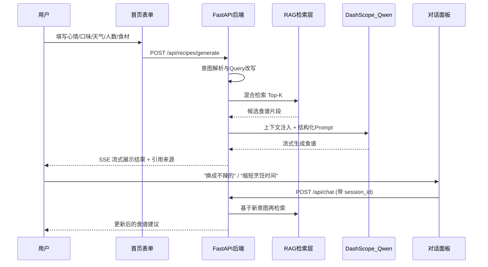
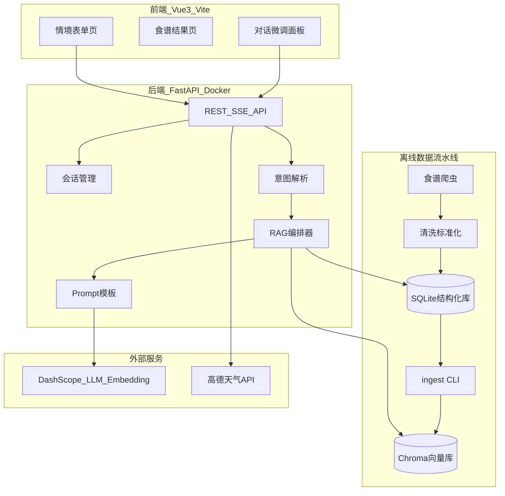

# 食刻（Shike）全栈工作流 Spec 文档

| 项目 | 说明 |
|------|------|
| 文档版本 | v1.0 |
| 创建日期 | 2026-07-21 |
| 适用范围 | `04_食刻web应用` |
| 状态 | MVP 基线 |

---

## 1. 项目概述

### 1.1 产品定位

「食刻」是一款基于 **LLM + RAG** 的智能饮食决策 Web 应用。用户根据 **心情、口味、天气、用餐人数、可用食材、健康目标** 等上下文，系统从本地食谱知识库检索候选方案，再由大模型生成 **个性化、可执行、可溯源** 的食谱建议。

### 1.2 核心价值

| 痛点 | 方案 |
|------|------|
| 菜谱 App 信息过载、选择困难 | 多维度条件一键收敛 + RAG 精准召回 |
| 通用大模型缺乏本地化食谱知识 | 自建结构化食谱向量库，回答有据可依 |
| 需求模糊复合（如「两人份+清淡+下雨」） | 意图解析 + 混合检索 + 重排序 |
| 模型幻觉 | RAG 引用溯源 + 结构化输出约束 |

### 1.3 已确认决策

- **交互**：混合模式 — 首页结构化表单收集核心条件，生成后可继续对话微调
- **模型**：DashScope API（通义千问）
- **部署**：Docker 自建后端 + 前端静态托管（Vercel / Nginx）

### 1.4 MVP 范围与非目标

**v1 做：**

- 食谱数据采集与清洗（目标 3,000~5,000 条，可扩展至 10,000+）
- 结构化存储 + Chroma 向量索引 + 混合检索
- 首页表单生成 + 生成后对话微调
- 天气自动获取（高德天气 API）
- Docker 一键部署后端，前端静态发布

**v1 不做：**

- 用户账号体系 / 多租户
- 食材图像识别
- 本地私有化 LLM 推理
- 生鲜价格 / 电商对接
- 移动端 App

---

## 2. 用户场景与功能需求

### 2.1 核心用户流程（混合交互）



### 2.2 功能需求表

| 编号 | 功能 | 描述 | 优先级 |
|------|------|------|--------|
| F1 | 情境表单 | 心情、口味、辣度、人数、耗时、健康目标、现有食材 | P0 |
| F2 | 天气联动 | 根据用户城市自动填充天气，影响推荐 | P0 |
| F3 | 一键生成 | 表单提交后 SSE 流式输出结构化食谱 | P0 |
| F4 | 对话微调 | 生成后继续多轮对话调整 | P0 |
| F5 | 引用溯源 | 展示推荐依据的食谱名称与来源链接 | P0 |
| F6 | 离线建库 CLI | 爬取 → 清洗 → 入库 → 向量化 一键流水线 | P0 |
| F7 | 收藏/历史 | 本地 session 内保存最近 10 条生成记录 | P1 |
| F8 | 反馈闭环 | 用户对推荐点赞/踩，写入日志供后续优化 | P2 |

### 2.3 首页表单字段设计

| 字段 | 类型 | 示例值 |
|------|------|--------|
| mood | 单选 | 开心 / 疲惫 / 想治愈 / 想尝鲜 |
| taste | 多选 | 咸鲜 / 酸甜 / 麻辣 / 清淡 |
| spice_level | 滑块 0-3 | 不辣 / 微辣 / 中辣 / 重辣 |
| servings | 数字 1-8 | 2 |
| cook_time | 单选 | 15分钟内 / 30分钟内 / 1小时内 / 不限 |
| health_goal | 单选 | 无 / 减脂 / 增肌 / 控糖 / 素食 |
| ingredients | 文本/标签 | 鸡蛋, 番茄, 面条 |
| city | 文本（可选） | 上海 |
| free_text | 文本（可选） | 昨天吃太油腻了，今天想清淡点 |

---

## 3. 系统架构

### 3.1 整体架构



### 3.2 技术选型

| 层级 | 选型 |
|------|------|
| 前端 | Vue 3 + Vite + TypeScript + Pinia |
| 后端 | FastAPI + Uvicorn + SSE |
| 结构化库 | SQLite |
| 向量库 | ChromaDB |
| Embedding | DashScope text-embedding-v3 |
| LLM | qwen-plus / qwen-turbo |
| Rerank | DashScope gte-rerank |
| 爬虫 | Playwright + BeautifulSoup |
| 天气 | 高德天气 API |
| 部署 | Docker Compose + Vercel 静态托管 |

---

## 4. 数据流水线

### 4.1 目录结构

```
04_食刻web应用/
├── spec/SPEC.md
├── backend/
│   ├── src/shike/
│   ├── pipeline/
│   ├── crawler/
│   ├── data/
│   ├── config/config.example.toml
│   ├── Dockerfile
│   └── pyproject.toml
├── frontend/
└── docker-compose.yml
```

### 4.2 食谱数据 Schema（SQLite）

见 `backend/src/shike/db/models.py` 中的 `CREATE TABLE` 定义。

### 4.3 RAG 切分与检索策略

1. Query 改写：表单字段 + 对话历史 → 检索 query
2. 混合召回：Chroma 向量 Top-20 + SQLite 标签过滤
3. 重排序：gte-rerank 取 Top-5
4. 父文档返回：命中 chunk 后返回完整食谱上下文

---

## 5. 后端 API

| 方法 | 路径 | 说明 |
|------|------|------|
| POST | `/api/recipes/generate` | 表单生成食谱（SSE 流式） |
| POST | `/api/chat` | 对话微调（SSE 流式） |
| GET | `/api/weather?city=上海` | 获取天气 |
| GET | `/api/sessions/{id}` | 获取会话历史 |
| GET | `/api/health` | 健康检查 |

---

## 6. 部署

### 6.1 环境变量

| 变量 | 说明 |
|------|------|
| `DASHSCOPE_API_KEY` | 通义千问 API |
| `AMAP_API_KEY` | 高德天气 |
| `DATABASE_PATH` | SQLite 路径 |
| `CHROMA_PATH` | Chroma 持久化路径 |
| `CORS_ORIGINS` | 前端域名白名单 |

### 6.2 启动命令

```bash
# 数据准备
cd backend && python -m pipeline.import_data --seed
python -m pipeline.ingest --all

# 本地开发
docker compose up -d

# 前端
cd frontend && npm run build
```

---

## 7. 实施阶段

| Phase | 内容 | 预估 |
|-------|------|------|
| 0 | 项目脚手架 | 1~2 天 |
| 1 | 数据流水线 | 3~5 天 |
| 2 | RAG 核心 | 3~4 天 |
| 3 | 后端 API | 2~3 天 |
| 4 | 前端页面 | 3~4 天 |
| 5 | 部署上线 | 1~2 天 |

---

## 8. 质量与验收标准

| 指标 | MVP 目标 |
|------|----------|
| 食谱库规模 | >= 3,000 条结构化记录 |
| 端到端响应 | 首 token < 3s，完整生成 < 15s |
| 检索相关性 | 人工抽检 Top-3 命中率 >= 70% |
| 表单必填覆盖 | 心情 + 口味 + 人数 三项即可生成 |
| 部署 | `docker compose up` 一键启动 |
